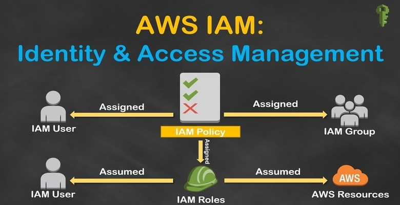

<a name='head1' />

### **1. IAM là gì**

- IAM (Identity and Access Management) là Service dùng để kiểm soát quyền truy cập, sử dụng tài nguyên trên AWS của các User/Group.

- Tất cả mọi User đều có thể sử dụng IAM mà không mất phí.

<a name='head2' />

### **2. IAM có thể giải quyết được những vấn đề gì**

- Tạo và chia sẻ quyền access cho các Account khác. 
- Chia nhỏ quyền access theo từng Service(VD:chỉ có thể access vào S3 nhưng không vào được EC2) hoặc theo từng model(VD:cung cấp key để access qua  API,CLI,SDK chứ không vào được console).
- Tạo và quản lý Policies, đồng thời gán policies cho các User/Group/Role.
- Tạo và quản lý Role, đồng thời gán role cho các User/Group.

<a name='head3' />

### **3. Những thuật ngữ chính trong IAM**

- Users
- Groups - Nhóm các users
- Roles
- Polocies - được đính kèm theo User/Group/Role trong IAM, chúng quy định những hành động nào được phép hoặc không được phép truy cập.
- MFA(Multi-factor Authentication) là 1 lớp bảo mật đặt trên username và password. Khi enable MFA, ngoài username và password, user khi đăng nhập sẽ phải điền authentication code nhận được từ MFA.
=> Sử dụng MFA để bảo vệ ngay cả khi bạn bị lộ username và password.

<a name='head4' />

### **4. Examination tips**

- IAM là service global.
- Account đầu tiên được tạo sẽ mặc định là root account.
- User mới sẽ không có persmission gì.
- User mới sẽ được cung cấp Access key ID và Secret Access key để có thể access thông qua  API,CLI hoặc SDK.
- Bạn chỉ có thể thấy Secret Access key này duy nhất 1 lần, vậy nên hãy lưu lại.
