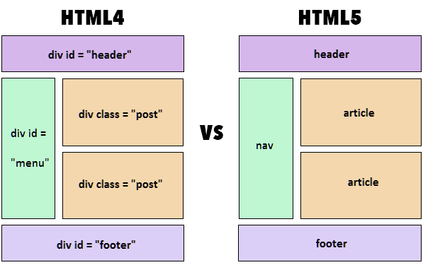

# HTML Semantic

Semantic HTML là cách viết HTML mà sử dụng các thẻ HTML ứng với nội dung được chứa trong nó chứ không phải sử dụng các thẻ theo cách mà chúng ta muốn nội dung trong đó được hiển thị. Ví dụ như không thể sử dụng thẻ `<h1>` để bọc 1 đoạn văn chỉ vì ta muốn đoạn văn đó có font chữ to ra. `<h1>` và `
` biểu diễn cho các nội dung rất khác nhau nên không thể sử dụng như thế.

### Một số thẻ HTML để phân chia nội dung trang

Từ phiên bản HTML5, đã có thêm 1 số thẻ mới như `<section>`, `<article>`, `<nav>`, `<aside>`,...

#### 1. Thẻ `<section>`
Thẻ section dùng để phân chia các phần riêng biệt của trang HTML, ví dụ trong trang có các phần như About, Contact,... thì các phần này sẽ được bọc trong các thẻ `<section>`.

#### 2. Thẻ `<article>`
Thẻ `<article>` dùng để chứa các nội dung độc lập trong trang. Những nội dung này có thể được cắt ra mang đi nơi khác mà người dùng ở nơi khác đọc vẫn có thể hiểu được, không phụ thuộc vào nội dung chứa trong trang.

Ví dụ như trong trang có chứa phần giới thiệu về 1 quyển sách. Nội dung phần giới thiệu này bao gồm tiêu đề sách, tác giả, tóm tắt, giá,... những nội dung này có thể được trích dẫn ra rồi đem đi trang khác chia sẻ mà người dùng ở trang khác đọc vẫn có thể hiểu được nội dung này là gì. Ở đây, nội dung giới thiệu về trang sách này nên được bọc trong thẻ `<article>`

#### 3. Thẻ `<nav>`
Thẻ nav khá dễ hiểu, nó dùng để chứa các thẻ `<a>` dùng để điều hướng đến những nội dung chính của website (nên lưu ý là của website chứ không phải của trang HTML hiện tại), `<nav>` thường được bọc trong `<header>` hoặc `<footer>`.

#### 4. Thẻ `<aside>`
Thẻ `<aside>` chứa 1 số thông tin bên lề nội dung chính của trang. Những nội dung chứa trong `<aside>` có thể bị xóa đi mà không làm ảnh hưởng đến nội dung chính của trang. Lưu ý, nếu `<aside>` nằm trong thẻ `<article>` thì nội dung nằm trong thẻ `<aside>` đó chỉ chứa thông tin bên lề nội dung chính của `<article>` chứ không phải của toàn trang.

#### 5. Thẻ `<main>`
Thẻ `<main>` dùng để chứa nội dung chính của trang, nó sẽ không chứa các thông tin như `<header>`, `<footer>`, `<aside>`,... hoặc những gì thuộc phần intro,...

**Trong 1 trang chỉ có 1 thẻ `<main>` duy nhất**

#### 6. Thẻ `
`
Thẻ `
` là thẻ không hề có *Semantic meaning*. Nó chỉ dùng để bọc những nội dung có liên quan đến nhau lại. Khi không tìm được thẻ thích hợp để bọc phần nội dung đó thì ta sẽ sử dụng thẻ div.

Ví dụ như phần *intro* của trang web, nó không thể nằm trên `header` cũng không thể nằm trong `main`, khi ấy ta sử dụng thẻ `
` để bọc các thông tin đó lại.

Ngoài ra, người ta còn sử dụng thẻ `
` để bọc những nội dung cần format giống nhau bằng CSS, cũng như tách trang thành từng phần nhỏ, để trình duyệt có thể render từng phần 1, tăng tốc độ hiển thị đến người dùng thay vì phải load toàn bộ trang mới.

#### 7. Thẻ `<header>` và thẻ `<footer>`
- Thẻ `<header>` bọc những thông tin giới thiệu về toàn trang web hoặc navigation bar
- Thẻ `<footer>` bọc những thông tin về trang web, thẻ footer của toàn trang thường chứa contact information, copyright information,... 
