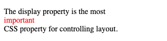

[Home](../index.md) / Making Layout

## Tạo bố cục - Making Layout

Tại thời điểm này chúng ta đã xem xét các nguyên tắc cơ bản về CSS, cách tạo kiểu cho văn bản cũng như cách thao tác với hộp chứa nội dung của bạn bên trong. Bây giờ, chúng ta xem xét các đặt các hộp vào đúng vị trí liên quan của chúng. Dưới đây là một số cách cài đặt hiển thị khác nhau, các công cụ bố cụ như Float, Display, Position, Flexbox,...

Một trang web thường được chia thành các phần: header (đầu trang), menu, content (nội dung) và footer (chân trang).

Có rất nhiều thiết kế bố cục khác nhau để bạn lựa chọn. Tuy nhiên, cấu trúc dưới đây là một trong những cấu trúc bố cục phổ biến nhất.


Và bây giờ cùng tìm hiểu các công cụ bố cục đã nêu ở trên hoạt động như thế nào để giúp chúng ta có thể xây dựng được cấu trúc bố cụ như ảnh này!

#### 1. Float
- Thuộc tính `float` được sử dụng để định vị và định dạng phần tử nổi trong trang web.
- Các giá trị:
    - `none`: Đây là giá trị mặc định, không làm nổi phần tử.
    - `left`: Làm cho phần tử nổi và nằm bên trái của vùng chứa.
    - `right`: Làm cho phần tử nổi và nằm bên phải vùng chứa.
    - `inherit`: Kế thừa giá trị float của phần tử chứa nó.

Ví dụ: Tạo một `<div>` chứa một đoạn văn bản và hình ảnh.
```
    img {
        float: none;
    }
```


```
    img {
        float: left;
    }
```


```
    img {
        float: right;
    }
```


- Thuộc tính `clear`: Chỉ định phần tử nào có thể trôi nổi bên cạnh phần tử đã xoá và ở phía nào.
- Các giá trị:
    - `none`: Đây là giá trị mặc định, cho phép phần tử nổi.
    - `left`: Không cho phép phần tử nổi nằm bên trái.
    - `right`: Không cho phép phần tử nổi nằm bên phải.
    - `both`: Không cho phép phần tử nổi nào nằm bên trái hoặc bên phải.
    - `inherit`: Kế thừa giá trị clear của phần tử chứa nó.
 
 Ví dụ:
 
 
 
 
 
#### 2. Position
- Thuộc tính position chỉ định loại phương pháp định vị được sử dụng cho một phần tử
- Các giá trị:
    - `static`: Đây là giá trị mặc định. Nếu có bộ chỉ số left/right/top/bottom/z-index thì sẽ không được áp dụng cho phần tử.
    - `relative`: Định vị vị trí tuyệt đối cho thành phần so với vị trí ban đầu của nó.
    
    
    
    - `absolute`: Định vị vị trí tương đối cho thành phần theo thành phần chứa nó (thành phần vị trí tương đối position: relative), hoặc theo `body`.
    
    
    
    - `fixed`: Định vị vị trí cố định đối với chế độ xem, ngay cả khi người dùng cuộn trang.
    
    
    
    - `sticky`: Định vị tuỳ thuộc vị trí cuộn của người dùng. 
    
    
    
    
    Khi người dùng cuộn chuột, phần tử chứa position: sticky sẽ bám dính lên đầu.
    
#### 3. Display
- Thuộc tính `display` chỉ định phần tử có được hiển thị hay không hoặc cách mà phần tử hiển thị.
- Một số giá trị sử dụng phổ biến:
    - `inline`: Đây là giá trị mặc định, thành phần sẽ hiển thị như một nội tuyến (không ngắt dòng).
    
        
    
    - `block`: Thành phần hiển thị như một khối, khi sử dụng giá trị `block` thành phần sẽ đứng một hàng độc lập so với thành phần trước và sau nó.
    
        
    
    - `inline-block`: Thành phần sẽ hiển thị như 1 khối, nhưng là khối nội tuyến. 
    - `none`: Không cho phép hiển thị, thường dùng cho JavaScript để thiết lập việc ẩn/hiện phần tử.
    - `inherit`: Xác định thừa hưởng thuộc tính từ thành phần chứa nó.
    
#### 4. Flexbox
Trước đây, nếu muốn dựng layout của trang thì sẽ dùng các thuộc tính `float` và `clear` để chia cột cho website như ý muốn. Hoặc muốn thuận tiện hơn thì sử dụng các framework để tiết kiệm thời gian. Nhưng đôi khi việc thường xuyên chia cột tốn rất nhiều thời gian với các kỹ thuật truyền thống, còn dùng framework thì lại khiến website có thêm nhiều đoạn CSS không cần thiết. Chưa kể áp dụng kỹ thuật thông thường hiện này thì ở mỗi thiết bị khác nhau cần lại cân đối lại kích thước khá phức tạp.

CSS3 ra đời giống như phiên bản cải thiện những nhược điển hiện có của nó, giúp cải thiện việc dàn trang linh hoạt hơn, đơn giản hơn. Và thuộc tính để sử dụng dàn trang là **Flexbox**.

**Flexbox** là một kiểu dàn trang (layout mode) mà nó sẽ tự cân đối kích thước của các phần tử bên trong để hiển thị với mọi thiết bị.

Dưới đây là sơ đồ cấu trúc Flexbox từ Mozilla Developer Network.


Hai thành phần quan trọng nhất trong một bố cục Flexbox đó là `container` và `item`. Trong bài viết này sẽ tập trung hướng dẫn sử dụng 2 thành phần này, các thành phần còn lại bạn có thể tham khảo thêm bên ngoài.
- `container`: là thành phần bao quanh các phần tử con, bạn sẽ thiết lập cách hiển thị theo chiều ngang hay chiều dọc, khi đó các phần tử bên trong sẽ hiển thị dựa trên thiết lập của `container` này.
- `item`: là các phần tử con của `container`, bạn có thể thiết lập nó sử dụng bao nhiêu cột trong một `container` hay thiết lập vị trí hiển thị của nó.

*Bắt đầu với Flexbox*

Để sử dụng, hãy thiết lập thuộc tính `display: flex` cho `container`:
```
container {
    display: flex;
}
```
##### 4.1. Thuộc tính *flex-direction*


`flex-direction: row | row-reverse | column | column-reverse;`

**flex-direction**: xác định hướng hiển thị các item.
- `row`: hiển thị theo chiều ngang.
- `row-reverse`: hiển thị theo chiều ngang, nhưng đảo ngược vị trí các item.
- `column`: hiển thị theo chiều dọc.
- `column-reverse`: hiển thị theo chiều dọc, nhưng đảo ngược vị trí các item .

##### 4.2. Thuộc tính *flex-wrap*


`flex-wrap: nowrap | wrap | wrap-reverse;`

**flex-wrap**: thiết lập các item nằm trên một hàng hay không.
- `nowrap`: trạng thái mặc định, tất cả các item sẽ nằm trên một hàng.
- `wrap`: các item sẽ tự động sắp xếp thành nhiều hàng khi vượt quá kích thước của `container`.
- `wrap-reverse`: tương tự `wrap` nhưng sẽ đảo ngược vị trí các item.

##### 4.3. Thuộc tính *flex-flow*
**flex-flow**: là thuộc tính viết tắt của `flex-direction` và `flex-wrap`.

`flex-flow: row wrap;`

##### 4.4. Thuộc tính *justify-content*


`justify-content: flex-start | flex-end | center | space-between | space-around | space-evenly;`

**justify-content**: xác định cách trình duyệt phân phối không gian giữa và xung quanh các item dọc theo trục chính của `container`.
- `flex-start`: các item được đóng gói về đầu của `flex-direction`.
- `flex-end`: các item được đóng gói về  của `flex-direction`.
- `center`: các item được căn giữa hàng.
- `space-around`: phân phối khoảng trắng trước và sau các item bằng nhau. Đối với giá trị này, khoảng trống đầu dòng và cuối dòng sẽ bằng nhau, khoảng trống nằm giữa các item sẽ lớn gấp đôi.
- `space-between`: phân phối khoảng trắng ở giữa các item bằng nhau, không có khoảng trắng đầu dòng và cuối dòng.
- `space-evenly`: phân phối khoảng trắng đầu dòng, cuối dòng và giữa các item đều bằng nhau.

##### 4.5. Thuộc tính *align-item*


`align-items: stretch | flex-start | flex-end | center | baseline;`
- `stretch`: đây là trang thái mặc định, giúp kép dài các item để lấp đầy `container`.
- `flex-start`: căn chỉnh các item ở đầu của `container`.
- `flex-end`: căn chỉnh các item ở cuối của `container`.
- `center`: căn chỉnh các item ở giữa của `container`.
- `base-line`: các item được căn chỉnh theo đường cơ sở.

##### 4.6. Thuộc tính *align-content*


`align-content: flex-start | flex-end | center | space-between | space-around | stretch;`

- `flex-start`: đóng gói tất cả các item về đầu của `container`.
- `flex-end`: đóng gói tất cả các item về cuối của `container`.
- `center`: đóng gói tất cả các item vào giữa của `container`.
- `space-between`: phân phối khoảng trắng vào giữa các dòng, các khoảng trắng này bằng nhau.
- `space-around`: phân phối khoảng trắng xung quanh mỗi dòng (lúc này khoảng cách lề trên của dòng đầu và khoảng cách lề dưới của dòng cuối sẽ bằng 1/2 khoảng cách giữa các dòng).
- `stretch`: kéo dãn các dòng để chiếm không gian còn lại của `container`.

##### 4.7. Thuộc tính *align-self*


```
<div class="container">
  <div>1</div>
  <div>2</div>
  <div style="align-self: flex-end">3</div>
  <div>4</div>
</div>
```

`align-self` chỉ định căn chỉnh vị trí linh hoạt cho item đã chọn. Thuộc tính `align-self` có thể ghi đè thuộc tính `align-items`.

##### 4.8. Thuộc tính *flex-grow*


`flex-grow` phân phối độ dài của `container`vào các item sao cho item được chỉ định sẽ có độ dài gấp số lần giá trị của thuộc tính so với các item còn lại. 

```
.item_2 { 
    flex-grow: 2
}
```

Ở ví dụ trên, item thứ 2 sẽ có độ dài gấp 2 lần so với các item còn lại.

##### 4.9. Thuộc tính *flex-shrink*


Bạn có thể hiểu tất cả các item đều có giá trị mặc định giá trị `flex-shrink: 1`. Điều này có nghĩa khi chúng ta thu nhỏ trình duyệt, các item sẽ đều co lại bằng nhau. `flex-shrink` giúp cho item được chỉ định sẽ co lại nhiều hơn so với các item khác bằng cách tăng giá trị của `flex-shrink` lên.
```
<div class="container">
  <div>1</div>
  <div>2</div>
  <div style="flex-shrink: 3">3</div>
  <div>4</div>
  <div>5</div>
  <div>6</div>
  <div>7</div>
  <div>8</div>
  <div>9</div>
  <div>10</div>
</div>
```
Ở ví dụ trên, khi thu nhỏ trình duyệt, item thứ 3 sẽ thu nhỏ gấp 3 lần so với các item khác.

##### 4.10. Thuộc tính *flex-basic*
`flex-basic` giúp chỉ định độ dài ban đầu cho item được chỉ định. Tất nhiên khi thu nhỏ trình duyệt, item này vẫm sẽ co nhỏ lại tương ứng trình duyệt.


```
<div class="container">
  <div>1</div>
  <div>2</div>
  <div style="flex-basis: 200px">3</div>
  <div>4</div>
</div>
```

##### 4.11. Thuộc tính *flex*

Thuộc tính `flex` là một thuộc tính viết tắt cho các thuộc tính `flex-grow`, `flex-shrink` và `flex-basic`.

`flex: [ <'flex-grow'> <'flex-shrink'> <'flex-basis'> ]`

Ví dụ: `flex: 0 0 200px`;

##### 4.12. Thuộc tính *order*
Theo mặc định, các item được sắp xếp theo thứ tự nguồn. Tuy nhiên, thuộc tính order kiểm soát thứ tự mà chúng xuất hiện trong `container`. Mặc định là 0.


```
<div class="container">
  <div style="order: 3">1</div>
  <div style="order: 2">2</div>
  <div style="order: 4">3</div>
  <div style="order: 1">4</div>
</div>
```

*Luyện tập thêm về Flexbox với trò chơi [Flexbox Froggy](https://flexboxfroggy.com/)*

Trong bài viết này, mình hướng dẫn các bạn làm quen với một số thuộc tính cơ bản trong xây dựng layout, ngoài ra còn có CSS Grid mình sẽ hướng dẫn vào lần sau.
