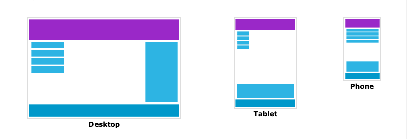
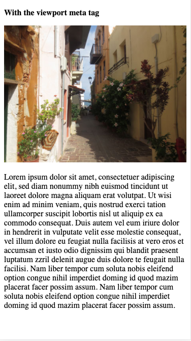
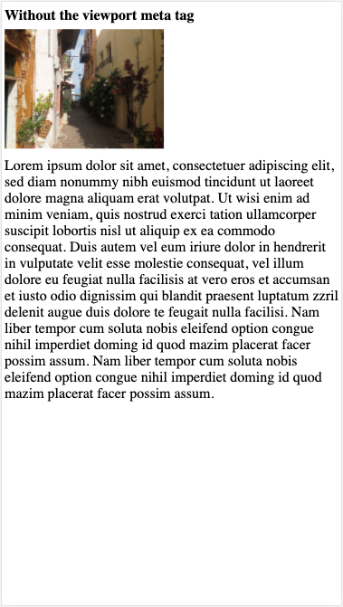
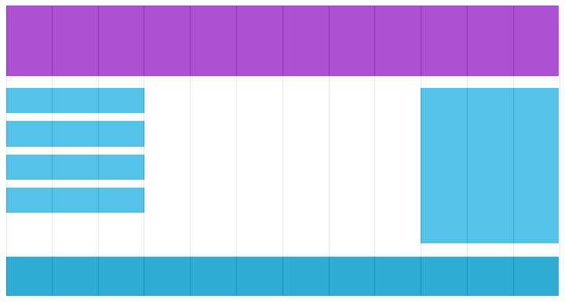
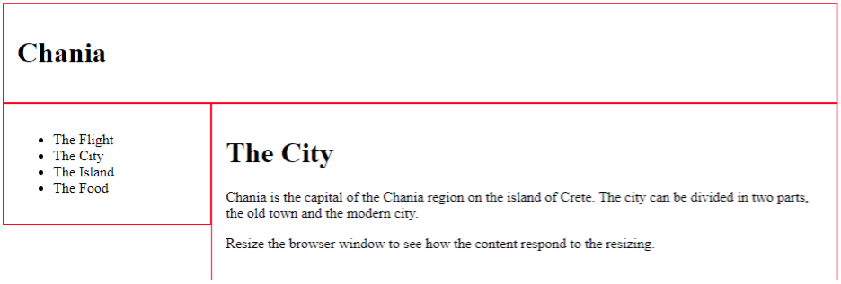

[Home](../index.md) / Responsive design and Media Queries

## Thiết kế thích hợp cho thiết bị - Responsive Web Design and Media Queries

Responsive Web Design (RWD) là làm cho trang web của bạn có thể xem tốt trên tất cả các thiết bị. Responsive Web Design chỉ sử dụng HTML và CSS. Responsive Web Design không phải là một chương trình hoặc đoạn mã JavaScript.



#### 1. Viewport
- Viewport - chế độ xem, là vùng hiển thị của người dùng trên một trang web.
- Chế độ xem thay đổi theo thiết bị và sẽ nhỏ hơn trên điện thoại di động so với màn hình máy tính.

*Chú ý:* Để kiểm tra một trang web có RWD đạt chất lượng cao hay không có thể dùng công cụ [PageSpeed Insignts](https://developers.google.com/speed/pagespeed/insights/) của Google để kiểm tra. Nếu đạt tối đa 100 điểm thì có nghĩa trang web của bạn thật tuyệt vời với mọi thiết bị.

**Setting the Viewport - Thiết lập chế độ xem**  
HTML5 giới thiệu một phương pháp để cho phép các nhà thiết kế web kiểm soát viewport, thông qua thẻ `<meta>`. Bạn có thể thiết lập meta viewport bằng cách đặt vào trong cặp thẻ `<head>` như sau:

```
<meta name="viewport" content="width=device-width, initial-scale=1.0">
```

- Thẻ `<meta>` viewport thiết lập cho trang web hiển thị tương ứng với kích thước của từng thiết bị khác nhau.
- `width=device-width`: đặt chiều rộng của trang web theo chiều rộng màn hình của thiết bị (sẽ thay đổi tuỳ theo thiết bị).
- `initial-scale=1.0`: thiết lập mức độ phóng ban đầu khi trang được trình duyệt tải lần đầu tiên, người dùng sẽ không thể zoom khi thuộc tính này có giá trị bằng 1.

So sánh ví dụ dưới đây khi trang web có meta viewport và không có meta viewport:

 

**Size Content to The Viewport - Kích thước nội dung cho khung nhìn**   
Hầu hết các trang web người dùng sử dụng bằng cách cuộn màn hình theo chiều dọc, chứ không phải chiều ngang. Vì vậy nếu người dùng buộc phải cuộn theo chiều ngang hoặc thu nhỏ/phóng to để xem toàn bộ trang web, điều đó dẫn đến trải nghiệm người dùng kém.

Một số quy tắc cần phải tuân theo:
- *KHÔNG sử dụng các phần tử có chiều rộng cố định*: Ví dụ: nếu một hình ảnh đươc hiển thị ở với chiều rộng lớn hơn khung nhìn, nó có thể khiến khung nhìn phải cuộn theo chiều ngang. Hãy nhớ điều đỉnh nội dung này để vừa với chiều rộng của khung nhìn.
- *Sử dụng icon SVG thay cho các icon bằng hình ảnh thông thường (PNG, JPG,...)*: Các icon, hình ảnh dạng SVG sẽ không bị mờ khi thu phóng ở bất kỳ kích thước nào, điều này sẽ giúp nội dung của trang web hiển thị tốt nhất trên các thiết bị như phone, tablet,...
- *Sử dụng CSS media queries để style cho từng thiết bị có chiều rộng khác nhau*: Không nên sử dụng các giá trị tuyệt đối như px, pt cho các phần tử mang tính bao quát trong trang, điều này sẽ làm cho nội dung của trang web sẽ bị tràn khi xem ở thiết bị có chiều rộng nhỏ hơn giá trị đã thiết lập. Thay vì vậy, hãy sử dụng các giá trị mang tính tương đối như %, ví dụ như width: 100%.

#### 2. Grid View
Grid View - chế độ xem dạng lưới, có nghĩa là trang web được chia ra thành các cột. 



Thông thường chế độ Grid View có 12 cột và tổng chiều rộng là 100%, đồng thời sẽ thu nhỏ hay mở rộng khi bạn thay đổi kích thước cửa sổ trình duyệt. 

**Building a Responsive Grid-View - Xây dựng chế độ xem lưới**

*Lưu ý*: Trong nội dung bài viết này Grid-View sẽ được xây dựng hoàn toàn 1 cách thủ công để chúng ta có thể hiểu rõ cơ chế hoạt động của 1 Grid-View là như thế nào, hoàn toàn không phụ thuộc vào các thư viện CSS có sẵn như Bootstrap,...

Trước tiên, hãy đảm bảo rằng tất cả các phần tử HTML có thuộc tính `box-sizing` được đặt thành `border-box`. Điều này đảm bảo rằng phần đệm và đường viền được bao gồm trong tổng chiều rộng và chiều cao của các phần tử.
```
* {
  box-sizing: border-box;
}
```
**HTML code**
```
<div class="header">
  <h1>Chania</h1>
</div>

<div class="menu">
  <ul>
    <li>The Flight</li>
    <li>The City</li>
    <li>The Island</li>
    <li>The Food</li>
  </ul>
</div>

<div class="main">
  <h1>The City</h1>
  <p>Chania is the capital of the Chania region on the island of Crete. The city can be divided in two parts, the old town and the modern city.</p>
  <p>Resize the browser window to see how the content respond to the resizing.</p>
</div>
```
**CSS code**
```
.header {
  border: 1px solid red;
  padding: 15px;
}
.menu {
  width: 25%;
  float: left;
}
.main {
  width: 75%;
  float: left;
}
```
Ta sẽ có 1 trang web đơn giản với bố cục như hình dưới đây:



Ví dụ trên sẽ tốt nếu trang web chỉ chứa hai cột.

Tuy nhiên, chúng ta muốn sử dụng grid-view với 12 cột, để có thể kiểm soát nhiều hơn các bố cục khác của trang web. Đầu tiên ta phải tính phần trăm cho một cột: 100% / 12 = 8.33%. Sau đó, ta tạo các class cho từng cột trong tổng số 12 cột, các class class="col-" và tỉ lệ tương ứng cho từng class đó.
```
.col-1 {width: 8.33%;}
.col-2 {width: 16.66%;}
.col-3 {width: 25%;}
.col-4 {width: 33.33%;}
.col-5 {width: 41.66%;}
.col-6 {width: 50%;}
.col-7 {width: 58.33%;}
.col-8 {width: 66.66%;}
.col-9 {width: 75%;}
.col-10 {width: 83.33%;}
.col-11 {width: 91.66%;}
.col-12 {width: 100%;}
```
Tất cả các cột này phải luôn định dạng nằm bên trái và có padding là 15px:
```
[class*="col-"] {
  float: left;
  padding: 15px;
  border: 1px solid red;
}
```
Mỗi hàng nên được đóng gói trong một `<div>`. Số cột bên trong một hàng tối đa 12 cột. Ví dụ:
```
<div class="row">
  <div class="col-3">...</div> <!-- 25% -->
  <div class="col-9">...</div> <!-- 75% -->
</div>
```
Để ngăn chặn việc nội dung của các row dưới có thể bị nhảy lên trên khi cột bên trên khi các thành phần bên trong row không đủ 12 cột, do các cột có thuộc tính float: left, ta thêm đoạn CSS dưới đây để giúp các row luôn độc lập với nhau:
```
.row::after {
  content: "";
  clear: both;
  display: table;
}
```
Bây giờ, ta có thể sửa đoạn HTML trên bằng việc sử dụng các class của grid-view mà chúng ta đã xây dựng như sau:
```
<div class="header">
  <h1>Chania</h1>
</div>

<div class="row">
    <div class="col-3 menu">
      <ul>
        <li>The Flight</li>
        <li>The City</li>
        <li>The Island</li>
        <li>The Food</li>
      </ul>
    </div>
    
    <div class="col-9">
      <h1>The City</h1>
      <p>Chania is the capital of the Chania region on the island of Crete. The city can be divided in two parts, the old town and the modern city.</p>
      <p>Resize the browser window to see how the content respond to the resizing.</p>
    </div>
</div>
```
Cần thêm 1 vài đoạn code css cho các thành phần trong trang để trang web trông đẹp hơn.
```
.header {
  background-color: #9933cc;
  color: #ffffff;
  padding: 15px;
}
.menu ul {
  list-style-type: none;
  margin: 0;
  padding: 0;
}
.menu li {
  padding: 8px;
  margin-bottom: 7px;
  background-color :#33b5e5;
  color: #ffffff;
  box-shadow: 0 1px 3px rgba(0,0,0,0.12), 0 1px 2px rgba(0,0,0,0.24);
}
.menu li:hover {
  background-color: #0099cc;
}
```
Các bạn có thể xem kết quả ở [đây](https://www.w3schools.com/cSS/tryit.asp?filename=tryresponsive_styles).

#### 3. Media Queries
Media Queries -  truy vấn phương tiện là một kỹ thuật được giới thiệu trong CSS3. Nó sử dụng `@media` để bao gồm một khối thuộc tính CSS chỉ khi một điều kiến nhất định là đúng.

Ví dụ: nếu màn hình có kích thước là 600px hoặc nhỏ hơn, màu nền sẽ là màu xanh:
```
@media screen and (max-width: 600px) {
  body {
    background-color: green;
  }
}
```

**Thêm Breakpoint**
Trước đó, trong series này chúng ta đã tạo một trang web với các hàng và cột và cũng đã có responsive. Tuy nhiên, trên các màn hình nhỏ thì lại chưa đáp ứng tốt cho người dùng.

Media Queries có thể giúp ta làm điều đó. Chúng ta có thể thêm các breakpoint, trong đó mỗi thành phần nhất định của trang web sẽ hiển thị khác nhau ở từng breakpoint khác nhau.

Ví dụ: Sử dụng Media Queries để định nghĩa breakpoint cho thiết bị có kích thước nhỏ hơn 768px:
```
/* For desktop: */
.col-1 {width: 8.33%;}
.col-2 {width: 16.66%;}
.col-3 {width: 25%;}
.col-4 {width: 33.33%;}
.col-5 {width: 41.66%;}
.col-6 {width: 50%;}
.col-7 {width: 58.33%;}
.col-8 {width: 66.66%;}
.col-9 {width: 75%;}
.col-10 {width: 83.33%;}
.col-11 {width: 91.66%;}
.col-12 {width: 100%;}

@media only screen and (max-width: 768px) {
    /* For mobile phones: */
    [class*="col-"] {
        width: 100%;
    }
}
```
*Ở đoạn code trên ta đã thêm vào cuối một đoạn CSS Media Query để định nghĩa khi kích thước màn hình (cửa sổ trình duyệt) nhỏ hơn 768px, mỗi cột luôn có chiều rộng là100%. Điều này có nghĩa là một khi gặp màn hình có kích thước <768px thì các thành phần HTML trong trang web chứa các class trên sẽ tự động full 100% màn hình để hiển thị tốt hơn nội dung cho người dùng.*

**Mobile First và Desktop First**
Có 2 cách để tạo RWD, **Mobile First** là thiết kế cho màn hình điện thoại di động trước, rồi sau đó tạo Media Queries thiết kế cho các màn hình khác (Điều này sẽ làm cho trang web hiển thị nhanh hơn trên các thiết bị nhỏ hơn). **Desktop First** là ngược lại, thiết kế cho màn hình Desktop trước.
Ví dụ cho Mobile First:
```
/* For mobile phones: */
[class*="col-"] {
    width: 100%;
}
@media only screen and (min-width: 768px) {
    /* For desktop: */
    .col-1 {width: 8.33%;}
    .col-2 {width: 16.66%;}
    .col-3 {width: 25%;}
    .col-4 {width: 33.33%;}
    .col-5 {width: 41.66%;}
    .col-6 {width: 50%;}
    .col-7 {width: 58.33%;}
    .col-8 {width: 66.66%;}
    .col-9 {width: 75%;}
    .col-10 {width: 83.33%;}
    .col-11 {width: 91.66%;}
    .col-12 {width: 100%;}
}
```

**Các breakpoint thông dụng hiện nay**
Có rất nhiều màn hình và thiết bị với chiều cao và chiều rộng khác nhau nên khó có thể tạo ra một breakpoint chính xác cho mỗi thiết bị. Tuy nhiên, đơn giản nhất thì sẽ có các breakpoint thông dụng sau đây:
```
/* Extra small devices (phones, 600px and down) */
@media only screen and (max-width: 600px) {...} 

/* Small devices (portrait tablets and large phones, 600px and up) */
@media only screen and (min-width: 600px) {...} 

/* Medium devices (landscape tablets, 768px and up) */
@media only screen and (min-width: 768px) {...} 

/* Large devices (laptops/desktops, 992px and up) */
@media only screen and (min-width: 992px) {...} 

/* Extra large devices (large laptops and desktops, 1200px and up) */
@media only screen and (min-width: 1200px) {...}
```

**Một số ví dụ về sử dụng Media Queries**
```
/* If the screen size is 600px wide or less, hide the element */
@media only screen and (max-width: 600px) {
  div.example {
    display: none;
  }
}
```
Hoặc có thể thay đổi kích thước font chữ trên trang web tương ứng với từng kích thước màn hình khác nhau chẳng hạn.
```
/* If the screen size is 601px or more, set the font-size of <div> to 80px */
@media only screen and (min-width: 601px) {
  div.example {
    font-size: 80px;
  }
}

/* If the screen size is 600px or less, set the font-size of <div> to 30px */
@media only screen and (max-width: 600px) {
  div.example {
    font-size: 30px;
  }
}
```
Và còn rất nhiều cách áp dụng Media Queries khi làm responsive nữa, tùy thuộc vào yêu cầu của từng trang web mà ta sẽ áp dụng cho phù hợp.

Các bạn có thể xem thêm và luyện tập cùng ví dụ ở [đây](https://codepen.io/nguyen-thuy-linh/pen/VwaKOdY?editors=1100)
