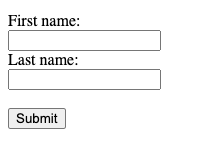

# Form and Validations

Form HTML là gì? Là một hình thức sử dụng để thu thập thông tin đầu vào của người dùng. Dữ liệu đầu vào có thể được gửi đến máy chủ để xử lý.
```
<form action="">
  <label for="fname">First name:</label>
  <input type="text" id="name" name="name"> <br/>
  <label for="lname">Last name:</label>
  <input type="text" id="name" name="name"> <br/>
  <input type="submit" value="Submit">
</form> 
```
Hiển thị: 



#### 1. Thẻ `<form>`
Thẻ `<form>` được dùng để tạo biểu mẫu cho đầu vào của người dùng.
```
<form>
.
*element*
.
</form>
```

Thẻ form có rất nhiều thuộc tính, trong đó có 2 thuộc tính rất quan trọng sau:
    - *action* - đường dẫn mà form sẽ gửi dữ liệu tới.
    - *method* - phương thức gửi dữ liệu bao gồm: POST, GET.

#### 2. Các phần tử của `<form>`
- `<label>`
- `<input>`: là phần tử quan trọng nhất của form, có thể được hiển thị qua nhiều, tuỳ thuộc vào thuộc tính
    - `<input type="text"/>`: hiển thị trường nhập văn bản một dòng.
    - `<input type="radio"/>`: hiển thị nút radio (để chọn một trong nhiều lựa chọn)
    - `<input type="checkbox"/>`: hiển thị ô check (để chọn nhiều lựa chọn cùng lúc)
    - `<input type="submit"/>`: hiển thị nút gửi (để gửi biểu mẫu)
- `<textarea>`: hiển thị trường nhập văn bản nhiều dòng. Có 2 thuộc tính quan trọng:
    - `cols`: thiết lập chiều rộng.
    - `rows`: thiết lập chiều cao (số dòng)
- `<label>`: gắn nhãn cho các phần tử của form. Trong trường hợp cần gắn nhãn cho nút radio/checkbox, hăy gắn thuộc tính `for` của thẻ `<label>` bằng thuộc tính `id` của thẻ `<input>` để liên kết chúng.
- `<select>`: hiển thị các tuỳ chọn trong danh sách.
- `<option>`: hiển thị mỗi tuỳ chọn cho thẻ `<select>`
- `<fieldset>`: nhóm các phần tử có liên quan trong một form, thẻ `<fieldset>` sẽ tạo một khung bao quanh các phần tử đó.

#### 3. Validations Form

HTML5 cung cấp một cách dễ dàng để "inline validation", sử dụng các thuộc tính input. Có một số lượng lớn các thuộc tính có sẵn, nhưng hiện tại hãy xem xét một số thuộc tính phổ biến nhất.
- `required`: Thuộc tính này quy định trường đầu vào không được để trống. Nó yêu cầu người dùng nhập nội dung nào đó trước khi gửi form.
```
<input type="email" name="email" id="email" placeholder="Email" required>
```
- `maxlength`, `minlength`: Chỉ định số lượng ký hiệu maximum/minimum (tối đa / tối thiểu) mà người dùng có thể nhập vào input. Điều này đặc biệt hữu ích trong các trường mật khẩu mà mật khẩu dài hơn có nghĩa là mật khẩu an toàn hơn.
```
<input type="password" name="password" minlength="6" id="password" placeholder="Password" required>
```
- `pattern`: Chỉ định cụm từ phải khớp với thứ tự dữ liệu đã nhập. Nó có thể được sử dụng với các loại input sau: **text, search, url, email, password**.
```
<input type="text" name="username" maxlength="15" minlength="4" pattern="^[a-zA-Z0-9_.-]*$" id="username" placeholder="Username" required>
```
