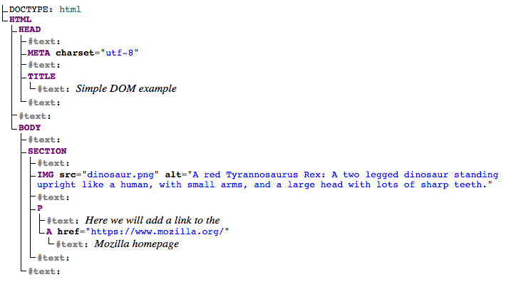

## Table of Contents - Cấu trúc **node**

[1. Foreword - Lời mở đầu](#head1)

[2. What ís DOM? - DOM là gì?](#head2)

[3. How JS Manipulating DOM? - Làm thế nào JS thao tác được DOM](#head3)

[4. Conclusion - Kết luận](#head4)


<a name='head1' />

### **1. Foreword - Lời mở đầu**

Từ thời hồng hoang, chúng ta có cuộc tình tay ba là HTML, CSS, JS tạo nên xử thi gọi là `HTML cơ bản` tay ba những không ngang trái đâu, bọn này kiểu Tây, nó lại thoải mái _:smile_, thời xưa có kể lại rằng DOM tức đại diện cho HTML và JS được đan xen chặt chẽ với nhau, nhưng cuối cùng, vì sự phát triền lâu dài nên chúng nó đã được tách nhau ra để phát triển. Hiểu đơn giản thì nội dung trang WEB được lưu trữ trong DOM, và có thể truy cập thông qua các thao tác của JS

Đã bao giờ bạn tự hỏi, làm thế éo nào khi click vào button nào đó, trang web bạn sẽ hiển thị lên mấy cái hộp thoại nhỉ, hay đoạn văn bản đổi màu, ...

Phần này chúng ta sẽ có thể nắm được những kiến thức như sau:

- Hiểu được khái niệm về DOM, từ đó hiểu được cách JS thao tác với nó.
- Làm thế nào để thay đổi nội dung, css của các phần tử HTML.
- Xử lý event của các phần tử HTML, ví dụ `click` button, hiển thị hộp thoại nào đó chẳng hạn.
- Thêm, xóa các phần tử HTMl.

<a name='head2' />

### **2. What is DOM? - DOM là gì?**

- DOM - Document Object Model là một giao diện lập tình cho tài liệu HTML và XML.
- Cung cấp đại diện cấu trúc của tài liệu, xác định con đường mà cấu trúc có thể được truy cập từ các chương trình để chúng có thể thay đổi cấu trúc, nội dung, ...
- Về cơ bản, nó kết nối các trang web tới các đoạn code, hay các ngôn ngữ lập trình(đương nhiên là bao gồm cả JS rồi :smile )


Hoặc có thể 1 cách dễ hiểu hơn như sau:

```html
<!DOCTYPE html>
<html>
  <head>
    <meta charset="utf-8" />
    <title>Simple DOM example</title>
  </head>
  <body>
    <section>
      
      <p>
        Here we will add a link to the
        <a href="https://www.mozilla.org/">Mozilla homepage</a>
      </p>
    </section>
  </body>
</html>
```

tương ứng với DOM như sau



Ở đây chúng ta thấy có 1 số các thuật ngữ cần hiểu để tiếp tục những phần sau dễ dàng hơn như sau:

- **Document**: Trang web
- **Root Element** node: Node cao nhất của tree, trong trường hợp này chính là thẻ `<html>`
- **Child node**: 1 `node con`, `trực tiếp` ngay dưới 1 node khác(`node cha`)
- **Descendant node**: 1 node bất kỳ bên trong node khác.
- **Parent node**: Node cha, hiển nhiên rồi, là node có chứa 1 node con nào đó.
- **Sibling nodes**: Node anh chị em (:smile), được hiểu là các node ngang hàng trong tree
- **Text node**: Node có chứa chuỗi(string)

<a name='head3' />

### **3. How JS Manipulating DOM? - Làm thế nào JS thao tác được DOM**

- Phần trên chúng ta đã hiểu thế nào là DOM, ở phần này chúng ta sẽ tìm hiểu JS sẽ thao tác với DOM như thế nào.

#### **Query Selectors**

**querySelector**

```js
let element = document.querySelector(selector);
```

- `selector` - một hoặc nhiều bộ chọn giống như CSS, ví dụ: `#id, .class, h1, div, ...`
- trả về phần tử đầu tiên có `selector` tương ứng hoặc nếu không tìm thấy sẽ trả về `null`

```html
<p>paragraph one</p>

<p>paragraph two</p>

<div>div one</div>

<p>paragraph three</p>

<div>div two</div>

<script>
  let firstDiv = document.querySelector("div");

  firstDiv.style.color = "red";
  // Đổi màu div one
  // phần này chúng ta sẽ cùng tìm hiểu phía sau, đừng lo lắng
</script>
```

**querySelectorAll**

```js
let element = document.querySelectorAll(selector);
```

- trả về toàn bộ các phần tử tương ứng với `selector` dưới dạng 1 đối tượng `NodeList array`, nếu không tìm thấy sẽ trả về 1 đối tượng NodeList rỗng `NodeList []`

```html
<p>paragraph one</p>

<p>paragraph two</p>

<div>div one</div>

<p>paragraph three</p>

<div>div two</div>

<script>
  let firstDiv = document.querySelectorAll("div");

  firstDiv.style.color = "red";
  // Đổi màu tất các div
  // phần này chúng ta sẽ cùng tìm hiểu phía sau, đừng lo lắng
</script>
```

#### **Element Creation**

**createElement**
- Phương thức này, như cái tên của nó, sẽ giúp bạn tạo mới phần tử HTML, sử dụng tên của thẻ HTML, như: `'p', 'div'`

```js
document.createElement(tagName);

let divElement = document.createElement('div');
```

- Lưu ý, khi này phần tử HTML được tạo mới này chưa xuất hiện trên trang web. Để phần tử này có thể xuất hiện trên trang web, chúng ta cần tìm hiểu phương thức bên dưới sau


#### **Append Elements**

**appendChild**

- Phương thức này sẽ thêm 1 child node vào cuối cùng cho phần tử HTML được gọi
```html
<div></div>
```

```js
let div = document.querySelector('div');
let strong = document.createElement('p');
strong.textContent = 'Hello';
div.appendChild(strong);
```
Sẽ được kết quả như sau

```html
<div>
    <p>Hello</p>
</div>
```

**insertBefore**

- Phương thức này sẽ thêm 1 phần tử con được chỉ định trước 1 phần tử con khác

```html
<div>
    <p>Hello</p>
</div>
```

```js
let newItem = document.createElement('strong');
let pElement = document.querySelector('p');
let div = document.querySelector('div');

newItem.textContent = 'hi';
div.insertBefore(newItem, pElement);
```
Sẽ được kết quả như sau

```html
<div>
    <strong>hi</strong>
    <p>Hello</p>
</div>
```

Thêm phần tử rồi, thì giờ chúng ta sẽ đến với xóa phần tử :smile

#### **Remove Elements**

**removeChild**

- Phương thức này sẽ xóa 1 phần tử con nào đó được chỉ định

```html
<div>
    <strong>hi</strong>
    <p>Hello</p>
</div>
```

```js
let removeElement = document.querySelector('strong');
let div = document.querySelector('div');
div.removeChild(removeElement);
```
Sẽ được kêt quả

```html
<div>
    <p>Hello</p>
</div>
```

Tiếp theo chúng ta sẽ đến với phần thao tác css của phần tử HTML

#### **Altering Elements**

- Khi tham chiếu đến 1 phần tử, JS có thể giúp chúng ta thay đổi thuộc tính của phần tử đó, có thể thấy như là: thêm, xóa, thay đổi các thuộc tính css, thay đổi class, ...

Bắt đầu **tạo 1 phần** tử HTML mới nào

```js
const div = document.createElement('div');                     
// create a new div referenced in the variable 'div'
```

**Thêm thuộc tính** cho phần tử trên

```js
div.style.color = 'blue';                                      
// adds the indicated style rule

div.style.cssText = 'color: blue; background: white';          
// adds several style rules

div.setAttribute('style', 'color: blue; background: white');    
// adds several style rules
```

- Lưu ý nhỏ ở đây là đối với 1 số thuộc tính sử dụng cách viết `kebab-cased` như `background-color` có thể gọi bằng cách sử dụng `camelCase` như sau `backgroundColor`

**Chỉnh sửa thuộc tính**

```js
div.setAttribute('id', 'theDiv');                              
// if id exists update it to 'theDiv' else create an id
// with value "theDiv"

div.getAttribute('id');                                        
// returns value of specified attribute, in this case
// "theDiv"

div.removeAttribute('id');                                     
// removes specified attribute
```

**Thao tác với `class`**

```js
div.classList.add('new');                                      
// adds class "new" to your new div

div.classList.remove('new');                                   
// remove "new" class from div

div.classList.toggle('active');                                
// if div doesn't have class "active" then add it, or if
// it does, then remove it
```

**Thêm nội dung text**

```js
div.textContent = 'Hello World!'                               
// creates a text node containing "Hello World!" and
// inserts it in div
```

**Thêm nội dung HTML**

```js
div.innerHTML = '<span>Hello World!</span>';                   
// renders the html inside div
```

- Lưu ý ở đây là `textContent` thích hợp hơn `innerHTML` nếu muốn thêm nội dung text.

Đến đây các bạn hãy dững lại đôi chút để có thể thực hành với những kiến thức bên trên nhé.

- Lưu ý:
    - JS không thay đổi HTML của bạn, nhưng DOM - tệp HTML sẽ giống nhau, còn JS thì sẽ thay đổi những gì trình duyệt hiển thị
    - Đôi khi nếu bạn đặt file JS lên đầu trang HTML của mình, thì những phần tử DOM sẽ chưa được render ra hết, do đó có thể code JS của bạn sẽ không hoạt động, cách khắc phục đơn giản nhất là đặt file JS ở cuối trang HTML.


#### **Events**

- Ở phần trước, chúng ta đã học cách để thao tác với các phần tử DOM qua HTML, phần này chúng ta sẽ học cách làm sao để việc đó xảy ra `động` trên trang web.
- `Events` là các sự kiện xảy ra trên trang web của bạn ví dụ _mouse-click_ - bấm chuột, _key-press_ - nhấn phím, ..., và khi sử dụng JS, chúng ta có thể xử lý code được trên các sự kiện này.
- Có **3 cách chính** để xử lý vấn đề này

**Phương pháp 1**
 ```js
<button onclick="alert('Hello World')">Click Me</button>
 ```
 Cách này thường sẽ ít hiệu quả hơn vì 
 - Chúng ta đang `gộp chung code HTML và JS` vào với nhau, do đó rất khó để kiểm soát, nếu sau này dự án của bạn lớn dần lên.
 - Ngoài ra chúng ta chỉ có thể có `1 sự kiện click trên mỗi phần tử`.


**Phương pháp 2**
```html
<!-- the html file -->
<button id="btn">Click Me</button>
```

```js
// the JavaScript file
const btn = document.querySelector('#btn');
btn.onclick = () => alert("Hello World");
```
- `() =>` ở đây mình có sử dụng 1 cách viết mới là` arrow function`, hãy google nhé.
- Cách này đã tốt hơn 1 chút, như bạn thấy, chúng ta đã tách biệt code JS và HTMl ra 2 file khác nhau.
- Nhưng vẫn còn vấn đề cần giải quyết là chúng ta vẫn chỉ có 1 sự kiện `onclick`.

**Phương pháp 3**

```html
<!-- the html file -->
<button id="btn">Click Me Too</button>
```

```js
// the JavaScript file
const btn = document.querySelector('#btn');
btn.addEventListener('click', () => {
  alert("Hello World");
});
```
- Cách này chúng ta đã giải quyết được vấn đề của 2 cách trên
- Tuy nhiên, `hãy linh hoạt`, cách 3 không phải lúc nào cũng là tối ưu nhé.

Chúng ta có thể tổng kết lại 3 cách trên bằng 1 ví dụ dưới đây

```html
<!-- the html file -->
<!-- METHOD 1 -->
<button onclick="alertFunction()" id="btn">CLICK ME BABY</button>
```
```js
function alertFunction() {
  alert("YAY! YOU DID IT!");
}

const btn = document.querySelector('#btn');

// METHOD 2
btn.onclick = alertFunction;

// METHOD 3
btn.addEventListener('click', alertFunction);
```

- Lưu ý: Hãy sử dụng `function - hàm` nếu thấy cần thiết, việc đó làm cho code bạn có hệ thống, dễ đọc, và dễ tái sử dụng hơn rất nhiều.

Nối tiếp ví dụ bên trên, cùng xem xét ví dụ dưới đây

```js
btn.addEventListener('click', function (e) {
  console.log(e);
});
```

- `function (e)` là 1 `callback function` từ function `addEventListener`, các bạn có thể tìm hiểu thêm về khái niệm `callback function` này sau nhé.
- `e` chính là đối tượng tham chiếu đến chính `event` đó, hãy ghi nhớ điều này, vì `e` sau này sẽ rất hữu dụng cho bạn.

Các bạn có thể thử chạy đoạn code dưới để thấy

```js
btn.addEventListener('click', function (e) {
  console.log(e);
  console.log(e.target);
  e.target.style.background = 'blue';
});
```
Tiếp sau đây chúng ta cùng giải quyết vấn đề là thêm sự kiện cho 1 nhóm đối tượng

**Thêm sự kiện cho 1 nhóm các đối tượng**

```html
<div id="container">
    <button id="1">Click Me</button>
    <button id="2">Click Me</button>
    <button id="3">Click Me</button>
</div>
```
Giả sử, chúng ta có 1 đoạn code HTML như trên, câu hỏi là làm thế nào để thêm cùng 1 sự kiện cho các button.

Để giải đáp vấn đề trên chúng ta có cách đơn giản nhất là thêm sự kiện cho từng `<button>` một. Nhưng nếu không chỉ có vài button, mà với số lượng lớn thì cách trên `không khả thi`.

Chúng ta cùng nhớ lại đôi chút những thao tác với DOM ở bên trên có 1 phương thức `querySelectorAll` trả về 1 mảng các node. Đây chính là giải pháp

```js
// buttons is a node list. It looks and acts much like an array.
const buttons = document.querySelectorAll('button');

// we use the .forEach method to iterate through each button
buttons.forEach((button) => {

  // and for each one we add a 'click' listener
  button.addEventListener('click', () => {
    alert(button.id);
  });
});
```

<a name='head4' />

### **4. Conclusion - Kết luận**
- Khái niệm về DOM
- Cách JS thao tác với DOM
- Cách thêm, sửa, xóa các phần tử HTML qua DOM
- Một số `events` thường dùng là
  - click
  - dblclick
  - keypress
  - keydown
  - keyup
- Sau cùng thì tất cả phần bên trên chỉ là 1 phần rất cơ bản khi nói đến việc `thao tác với DOM` và xử lý `event`, nhưng mình nghĩ, về cơ bản như thế là đủ để bạn bắt đầu với việc dùng JS để xử lý website của mình thông qua DOM

---

Copyright © **[@hoangpn](https://hoangpn.com)**, member of **Hituno Team**, 2020
