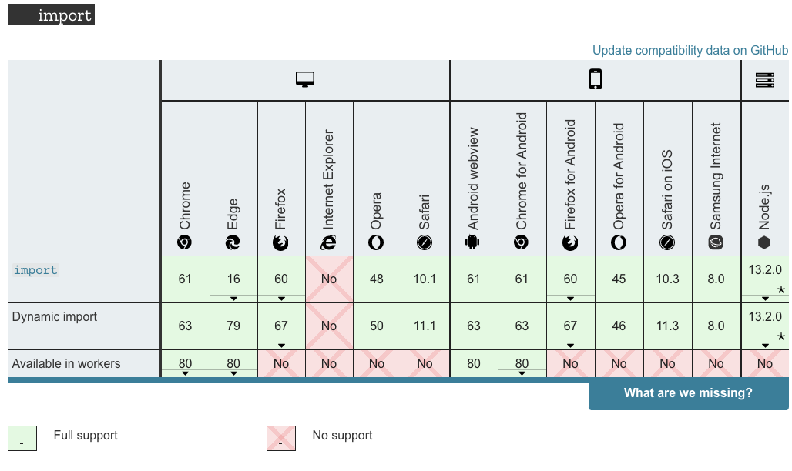
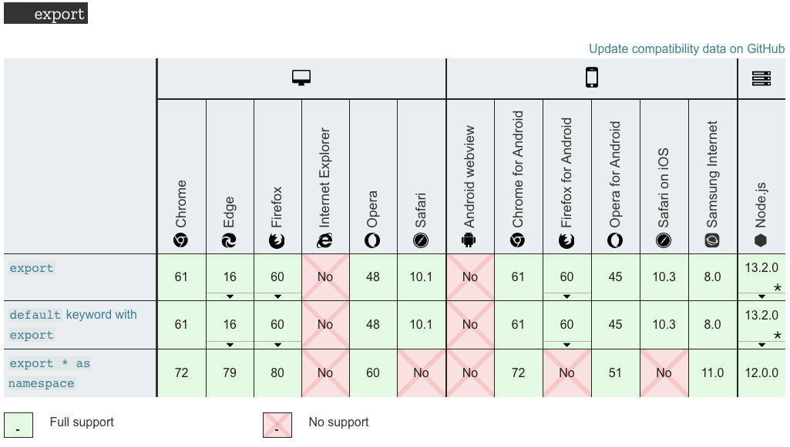

## Table of Contents - Cấu trúc **node**

[1. Lời mở đầu](#head1)

[2. Modules và cách sử dụng trong ES6](#head2)

[3. Lợi ích của modules](#head3)

[4. Những điều mới trong ES6+](#head4)

[5. Kết luận](#head4)


<a name='head1' />

### **1.Lời mở đầu**

- Như chúng ta biết, ban đầu JS là những đoạn script khá nhỏ, phần lớn là để xử lý các tác vụ cô lập.
- Nhưng với sự phát triển mạnh mẽ, cho đến ngày nay chúng ta có những ứng dụng hoàn chỉnh được viết hoàn toàn bằng JS, điển hình có thể thấy là Node.js
- Do đó, việc phân tách các đoạn code JS thành các module riêng biệt, và import khi cần là điều hoàn toàn cần thiết.

<a name='head2' />

### **2. Modules và cách sử dụng trong ES6**
**Module là gì?**

- Trong JS, module có thể hiểu là những đoạn code có liên quan tới nhau được gom nhóm lại.
- Đây là nền tảng cho rất nhiều các Design Patterns, và là cực kì cần thiết để xây dựng các thư viện, ứng dụng sử dụng JS
- JS ddã hộ trợ module từ rất lâu, tuy nhiên là dưới dạng thư viện, cho đến ES6, thì mới có các module tích hợp sắn(`built-in`)

JS làm việc với module thông qua `import` và `export`.

**Browser hỗ trợ như thế nào**





**Cùng đi tìm hiểu 1 số ví dụ**


**`IMPORT`**

Ban đầu, chúng ta thực hiện việc chèn thủ công các file js riêng lẻ vào HTML như sau

```html
<!DOCTYPE html>
<head>
</head>
<body>
  
  <!--HTML content goes here-->
  
  <script src="js/jquery.js"></script>
  <script src="js/script2.js"></script>
  <script src="js/script3.js"></script>
  <script src="js/script4.js"></script>
</body>
</html>
```
Khi sang ES6, chúng ta có bộ đôi import và export, thực hiện như sau

1. Tạo 1 file `app.js`

```js
import { jquery } from './js/jquery.js';
import { script2 } from './js/script2.js';
import { script3 } from './js/script3.js';
import { script4 } from './js/script4.js';
```

2. Sau đó chúng ta chỉ cẩn chèn file app.js vào HTML như thông thường

```html
<!DOCTYPE html>
<head>
</head>
<body>
  
  <!--HTML content goes here-->
    <script type="module" src="js/app.js"></script>
</body>
</html>
```

Chúng ta sẽ nói về lợi ích của module ở phần sau, nên nếu bạn lo lắng cách này hơi lằng nhằng thì đọc tiếp nhé!

**`EXPORT`**

Đối với export, các bạn có thể hiểu lả dùng để `khai báo` nhưng đối tượng để import có thể thực hiện

1. Chúng ta có file `math.js` để thực hiện khai báo các `function tính toán`

```js
let sumAll = (a, b) => {return a + b;}
let subtractAll = (a, b) => {return a - b;}
let divideAll = (a, b) => {return a / b;}
let multiplyAll = (a, b) => {return a * b;}
let findModulus = (a, b) => {return a % b;}
```
2. Nếu chỉ định nghĩa các function thế này thì chỉ có thể sử dụng bên trong file `math.js` thôi, nhưng chúng ta muốn sử dụng ở các file khác


```js
export let sumAll = (a, b) => {return a + b;}
export let subtractAll = (a, b) => {return a - b;}
export let divideAll = (a, b) => {return a / b;}
export let multiplyAll = (a, b) => {return a * b;}
export let findModulus = (a, b) => {return a % b;}
```

hoặc 

```js
let sumAll = (a, b) => {return a + b;}
let subtractAll = (a, b) => {return a - b;}
let divideAll = (a, b) => {return a / b;}
let multiplyAll = (a, b) => {return a * b;}
let findModulus = (a, b) => {return a % b;}
export {sumAll, subtractAll, divideAll, multiplyAll, findModulus};
```

hoặc nếu muốn sử dụng `default`

```js
export default {sumAll, subtractAll, multiplyAll, divideAll};
```

3. Giờ muốn sử dụng các `function` của `math.js` ở `main.js`

```js
import {sumAll} from './math.js';
console.log(sumAll(9, 8)); //17
```
hoặc
```js
import * as math from './math.js';
console.log(math.sumAll(5, 2)); // 7
```
hoặc nếu bạn sử dụng `export defailt` thì chúng ta có thể `import` như sau
```js
import math from './math.js';
console.log(math.sumAll(5, 2)); // 7
```


_Chú ý_ 
1. Chỉ `import, hoặc export` các function cần thiết.
2. Modules được `import` bằng tham chiếu tuyệt đối, hoặc tương đối, và `bắt buộc` phải bắt đầu bằng `/`, `./` hoặc `../`
3. Có thể import nhiều file, nhưng hãy nhớ điều 1, chỉ khi thực sự cần thiết.
```
import {sumAll} from 'math.js'; ❌
import {sumAll} from 'lib/max.js'; ❌
import {sumAll} from './math.js'; ✔️
import {sumAll} from '../max.js'; ✔️
import {sumAll} from 'https://bolaji-module.glitch.me/sumAll.js'; ✔️
```
<a name='head3' />

### **3. Lợi ích của modules**

- Code có thể tách ra thành các file nhỏ hơn, có các chức năng độc lập với nhau.
- Nhiều file script có thể kết nối với nhau, do đó tăng hiệu suất.
- Dễ dàng `debugging`
- Dễ dàng cho việc tái sử dụng, chia sẻ code của mình.
- Dễ dàng bảo trì, phát triển, ..

Tóm gọi lại, đây là 1 bược tiến rất quan trọng để phát huy điểm mạnh của JS, cũng có thể hiểu là `module giúp việc coding dễ dàng hơn`.

<a name='head4' />

### **4. Những điều mới trong ES6+**
Dưới đây là các `tính năng mới nổi bật`, mà các developer thường xuyên sử dụng trong các phiên bản `ES6+`, các bạn có thể tham khảo toàn bộ các tính năng trên trang chủ của JS nhé.

#### ES6 - 2015
1. Arrow functions
2. Classes
3. Template strings
4. Let and Const
5. Promises
#### ES7 - 2016
1. Array.prototype.includes
2. Exponentiation Operator
#### ES8 - 2017
1. Object.values() and Object.entries()
2. String.prototype.padEnd() and String.prototype.padStart()
3. Async function(async/await)
#### ES9 - 2018
1. Asynchronous iteration
2. Rest operator
3. Promise.prototype.finally
#### ES10 - 2019
1. Optional Catch Binding
2. Object.fromEntries()
3. Array.flat()
4. Array.flatMap()
5. String.trimStart() & String.trimEnd()
6. Dynamic Import
7. globalThis Object
#### ES11 - 2020
1. Optional Chaining ?.
2. Private fields #
3. undefined javascript - Nullish Coalescing ??
4. Top Level await

#### ES6
**1. Arrow functions**

Arrow function (=>) là cách viết `shorthand` của cú pháp function, arrow function có 2 ưu điểm sau đây
 - Code của các bạn sẽ dễ nhìn hơn rất nhiều, thường không qúa dài dòng như dùng function bình thường
 - Giúp cho chúng ta tránh sử dụng `.bind()` hoặc các phương thức khác để sử dụng đúng cách `this`, vì arrow function dùng chung `lexical this` trong toàn bộ thân hàm.

```js
// traditional function expression
var numbers = [2, 6, 40];
var twiceNum = numbers.map(function(number) { return number*2 })
// arrow functional
var numbers = [2, 6, 40];
var twiceNum = numbers.map((number) => number*2);
// lexical this
var greenBtn = document.getElementById(‘greenBtn’);
greenButton.addEventListener(‘click’, function() {
 this.style.backgroundColor = “red”; // no more binding
})
```
**2. Classes**

Tất nhiên rồi, đối với developer chúng ta đã quá quen thuộc với lập trình hướng đối tượng `OOP` thì classes có thể là 1 tính năng mới rất hữu ích cho chúng ta. Điều đó làm cho code based của chúng ta rất hệ thống dựa trên `class pattern`. Classes hỗ trợ các `prototype inheritance`, `constructors`, `super` calls and `instance` and `static methods`
```js
// Class
class Person {
 constructor(firstName, lastName, age) {
   this.firstName = firstName;
   this.lastName = lastName;
   this.age = age;
 }
sayHi() {
   return `Hi, my name is ${firstName}. Nice to meet you.`;
 }
}
```

**3. Template strings**

Có thể ở ví dụ bên trên bạn đã nhìn thấy có sử dụng `Template strings`. ES6 triển khai 1 tính năng thực sự rất hữu ích đó là `Template strings`, nó cho phép chúng ta có thể triển khai các biến vào trong 1 chuỗi string mà không cần tách ra thành các chuỗi `+` với nhau. Cách dùng đơn giản chỉ là đặt biến vào trong cặp `${}`.
```js
var name = ‘Peter’, city = ‘London’;
// Before ES6
var greeting = "Hello, my name is " + name + ". I am from " + city + ".";
// After ES6 
var greeting = ‘Hello, my name is ${name}. I’m from ${city}.‘
```
**4. Let and Const**

ES6 triển khai 2 keywords mới để khai báo biến là `const`, `let`. `let` hoạt động khá giống với `var` nhưng biến chỉ có giá trị trong phạm vi `block scope`, `const` thì dùng để khai báo `hằng số`, hoạt động thì như `let` nhưng sẽ không thay đổi được giá trị.
```js
// Let - variable is available only in the block of code
function calculate(x) {
     var y = 0;
     if (x > 10) { // let y is only available in this block of code
         let y = 30;
         return y;
     }
     return y;
}
```
**5. Promises**

ES6 đã cung cấp cho chúng ta cách triển khai Promise được tiêu chuẩn hóa. điều này thực sự hữu ích cho việc chúng ta phải thường xuyên lập trình bất đồng bộ. Chúng ta không cần phải lo lắng về callback hell nữa. Promise luôn có 3 trạng thái như sau: `pending`, `filfiled`, `rejected`. Đương nhiên là bạn cũng có những phương thức tương ứng để xử lý 3 trạng thái trên như sau: `then()` đối với việc promise được `resolved`, `catch()` đối với việc promise bị `rejected`


```js
const checkResult = () => new Promise(resolve, reject) => {
setTimeout(resolve, 500)} 
checkResult()
 .then((result) => { console.log(result); }) 
 .catch((error) => { console.log(error); })
```
#### ES7 - 2016
**1. Array.prototype.includes**

Trong ES7 xuất hiện thêm 1 phương thức mới cho mảng đó là `includes()`, phương thức này giúp kiếm tra một phần tử có trong mảng hay không, đương nhiên trước đây chúng ta vẫn có thể dùng `indexOf` để kiểm tra, nhưng đối với `includes` thì đơn giản hơn nhiều 

```js
var fruits = ['banana', 'apple', 'grape', 'nut', 'orange'];
var favoriteFruit = 'banana';
// Before ES7
function isFruit(fruit) {
 if (fruits.indexOf(fruit) !== -1) {
   return true;
 } else {
   return false;
 }
}
isFruit(favoriteFruit); // returns true
// After ES7
fruits.includes(favoriteFruit); // returns true
```

**2. Exponentiation Operator**

Điều này khá hữu ích đối với các developer hay làm việc với các phép toán nâng cao, hay 3D, VR, hay data visualization, tương tự như `Math.pow()`, nhưng cách này thì ít phức tạp hơn nhiều.
```js
// Before ES7 (loop case) 
function calculate(num, exponent) { 
   var res = 1; 
   for (var i = 0; i < exponent; i++) { 
     res *= num; 
   } 
   return res;
}
// After ES7
const calculate = (num, exponent) => num ** exponent;
```
#### ES8 - 2017
**1. Object.values() and Object.entries()**

Thử tưởng tượng, bạn có 1 đối tượng dạng `key-value`, và bạn muốn lấy hết tất cả các keys hoặc values của đối tượng đó, thì bạn sẽ làm thế nào??. Sang với ES8, vấn đề đó đươc giải quyết 1 cách hết sức đơn giản
```js
var person = {
 name: ‘Jenny’,
 age: 24,
 country: ‘UK’,
 city: ‘London’,
}
// Object.values()
var arrJenny = Object.values(person); // returns [‘Jenny’, 24, ‘UK’, ‘London’];
// Object.entries()
var arrJennyEntries = Object.entries(person); // returns [[‘name’, ‘Jenny’], [‘age’, 24], [‘country’, ‘UK’], [‘city’, ‘London’]];
```

**2. String.prototype.padEnd() and String.prototype.padStart()**

Sang đến ES8 nếu chuỗi string của bạn không đủ dỗ dài mong muốn, bạn có thể sử dụng 1 trong 2 method mới là `padEnd()` hoặc `padStart()` để thêm 1 chuỗi còn nào đó vào chuỗi của bạn cho đến khi đủ độ dài yêu cầu thì thôi.

```js
var string = ‘Alice’; 
// padStart() — we assume our string needs to have 10 characters 
string.padStart(10, ‘o’); // returns ‘oooooAlice’
// padEnd() 
string.padEnd(10, ‘o’); // returns ‘Aliceooooo’;
```
**3. Async function(async/await)**

Trong ES8, chúng ta đã được cung cấp 1 giải pháp tối ưu hơn rất nhiều cho việc xử lý với callbacks và promise đối với lập trình bất đồng bộ -  đó là `async/await` function. `async function` định nghĩa khai báo 1 function bất đồng bộ, và nó trả về 1 promise đã được resolved hoặc rejected. Ngoài ra còn có từ khóa `await` `chỉ được sử dụng bên trong` hàm `async`, và nó dùng để `chờ đợi` 1 `promise`. Cách viết async/await, cho chúng ta 1 syntax hết dược đẹp đẽ, và với lời khuyên các nhân của mình, nếu điều kiện cho phép(yêu cầu dự án, version của brower) thì bạn nên chuyển đổi sang hết async/await.

```js
function delayResult() {
 return new Promise(resolve => {
   setTimeout(() => {
     resolve(‘Done’);
   }, 5000)
 })
}
async function getResult() {
 var result = await delayResult();
 return result;
}
getResult();
```

#### ES9 - 2018
**1. Asynchronous iteration**

Bất đồng bộ và vòng lặp, là 1 bài toán khá đau đầu để giải quyết, đến với ES9, chúng ta có 1 cách sử lý khá đơn giản như sau, nhưng nó chỉ có thể sử dụng nếu dữ liệu đến từ 1 nguồn đồng bộ, không thể đùng được với dữ liệu bất đồng bộ từ việc fetching data.

```js
for await (let book of books) { 
 console.log(book) 
};
```
**2. Rest operator**

Toán tử `rest`, cách dùng khá đơn giản như ví dụ bên dưới. 1 điều lưu ý là toán tử này `chỉ được dùng ở cuối`

```js
const fruits = { orange: 1, apple: 10, banana: 4, } 
const { orange, …rest } = fruits; 
console.log(rest); // { apple: 10, banana: 4 };
// in the function
function getFruits(apple, …rest) { 
 return rest.banana;
}
```
**3. Promise.prototype.finally**

`finally` là 1 phương thức sử dụng với promise, chúng luôn được gọi sau cùng, dù cho promise có `then()` hay `catch()`

```js
const checkResult = () => new Promise(resolve, reject) => {setTimeout(resolve, 500)}
checkResult() 
 .then((result) => { console.log(result); }) 
 .catch((error) => { console.log(error); }) 
 .finally(() => { console.log(`Promise finished!`) })
```
#### ES10 - 2019
**1. Optional Catch Binding**

Chúng ta không cần truyển tham số vào `catch()` nữa

```js
try {
  doSomethingThatMightThrow();
} catch (exception) {
  //     ^^^^^^^^^
  // We must name the binding, even if we don’t use it!
  handleException();
}

// ES10
try {
  doSomethingThatMightThrow();
} catch { // → No binding!
  handleException();
}
```
**2. Object.fromEntries()**

Cách hoạt động gần như ngược lại của `Object.entries`

```js
const entries = new Map([
  ['foo', 'bar'],
  ['baz', 42]
]);

const obj = Object.fromEntries(entries);

console.log(obj);
// { foo: "bar", baz: 42 }
```
**3. Array.flat()**

Dàn đều các phần tử trong mảng.

```js
var arr1 = [1, 2, [3, 4]];
arr1.flat(); 
// [1, 2, 3, 4]

var arr2 = [1, 2, [3, 4, [5, 6]]];
arr2.flat();
// [1, 2, 3, 4, [5, 6]]

var arr3 = [1, 2, [3, 4, [5, 6]]];
arr3.flat(2);
// [1, 2, 3, 4, 5, 6]

var arr4 = [1, 2, [3, 4, [5, 6, [7, 8, [9, 10]]]]];
arr4.flat(Infinity);
// [1, 2, 3, 4, 5, 6, 7, 8, 9, 10]
```

**4. Array.flatMap()**

```js
let arr1 = ["it's Sunny in", "", "California"];

arr1.map(x => x.split(" "));
// [["it's","Sunny","in"],[""],["California"]]

arr1.flatMap(x => x.split(" "));
// ["it's","Sunny","in", "", "California"]
```
**5. String.trimStart() & String.trimEnd()**
```js
var greeting = '   Hello world!   ';

console.log(greeting);
// "   Hello world!   ";

console.log(greeting.trimStart());
// "Hello world!   ";

console.log(greeting.trimEnd());
// "   Hello world!";
```

**6. Dynamic Import**

Phần này đọc lại module nhé!

**7. globalThis Object**

```js
const global = Function('return this')();

const getGlobal = function () {
  if (typeof self !== 'undefined') { return self; }
  if (typeof window !== 'undefined') { return window; }
  if (typeof global !== 'undefined') { return global; }
  throw new Error('unable to locate global object');
}

const global = getGlobal(); // will return window object in the browser

// array usage example
const numbers = new global.Array(1, 2, 3);
console.log(numbers); // outputs [1, 2, 3];
```

#### ES11 - 2020
**1. Optional Chaining ?.**

Chúng ta có thể chaning 1 chuỗi các phương thức, thuộc tính, nếu chúng ta không biết chắc phương thức hay thuộc tính trước đó có giá trị hay không?

```js
const player = {
    details: {
        name: {
            firstName: "Hoang",
            lastName: "Pham",
	   age: 26
        }
    },
    jobs: [
        "dev js",
        "dev ruby"
    ]
}

const playerFirstName = player?.details?.name?.firstName;
// Nếu không có thì sẽ không báo lỗi.
```

**2. Private fields #**

Cách viết mới khi muốn khai báo 1 thuộc tính là `private`

```js
class Foo {
  #b = 15;
  a = 10;
  get() {
    return this.#b;
  }

  increment() {
    ++this.#b;
  }
}
const obj = new Foo();

obj['#b']; // undefined
obj.a = 10;
obj.hasOwnProperty('#b'); // false
```
**3. undefined javascript - Nullish Coalescing ??**

```js
const test1 = undefined || 'Foo';
// 'Foo'
const test2 = false || 'Foo';
// 'Foo'
const test2 = false ?? 'Foo';
// false
// ?? cho phép giá trị boolean.
```
**4. Top Level await****

1 Tính năng vẫn rất rất mới cho đến thời điểm hiện tại, mình sẽ không để cập quá sau ở đây, sẽ hẹn các bạn bằng 1 bài viết cụ thể khác. Nhưng về cơ bản các bạn có thể hiểu `Top-level await` cho phép developers `sử dụng await mà không cần khai báo async function`. Và nó hoạt động như 1 async function. Các bạn có thể tham khảo thêm tại [v8.dev](https://v8.dev/features/top-level-await) hoặc [tc39](https://github.com/tc39/proposal-top-level-await)

<a name='head5' />

### **5. Kết luận**

- ES6 module là 1 trong những tính năng lớn nhất trong các trình duyệt thông dụng hiện giờ.
- Là nền tảng cho các `Framework JS` như `Vue.js`, `React.js`
- Không phải trình duyệt nào cũng hỗ trợ ES6, nên hãy lưu ý đối với những trường hợp đặc biệt, trên thực tế chúng ta có thể dùng các trình biên dịch để có thể sử dụng đc ES6 ở các trình duyệt cũ.
---

Copyright © **[@hoangpn](https://hoangpn.com)**, member of **Hituno Team**, 2020
