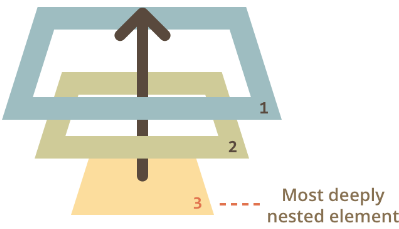
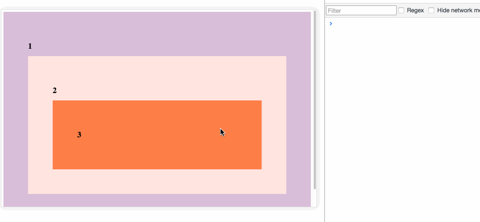
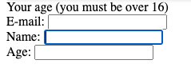
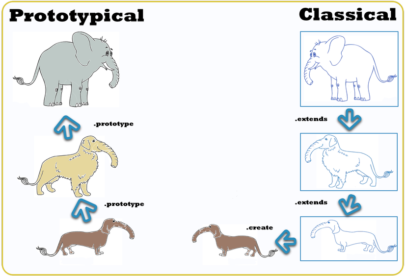
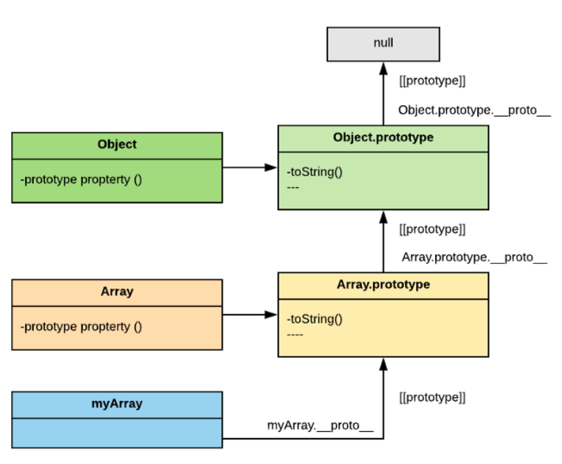
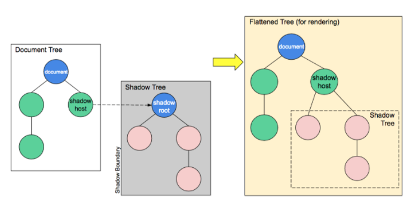
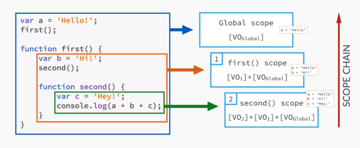
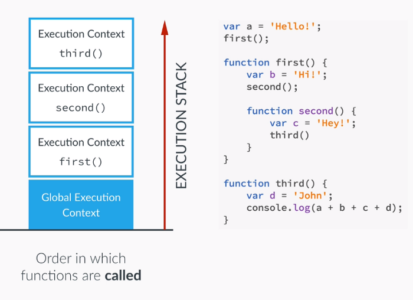
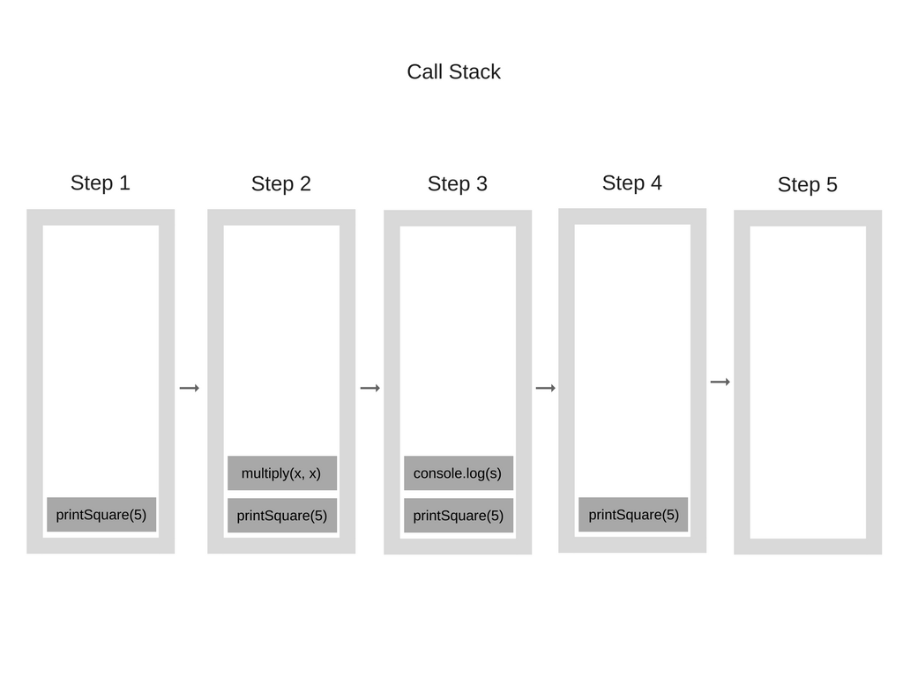

#### Các concept quan trọng của JS

1. [Hoisting](#head1)
2. [Event Bubbling](#head2)
3. [Scope](#head3)
4. [Closure](#head4)
5. [Prototype & Prototype Chain](#head5)
6. [Shadow DOM](#head6)
7. [Strict](#head7)
8. [Execution context, Execution Stack](#head8)
9. [Bind, Call, Apply](#head9)
10. [Primitives vs Objects](#head10)

<a name='head1' />

#### Hoisting

- Là 1 hành động mặc định của JS, chuyển phần khai báo lên phía trên top. Hiểu đơn giản thì có thể sử dụng biến hoặc function trước rồi mới khai báo.
- JS chỉ đưa các định nghĩa, chứ không phải các khởi tạo(`*`)

Cùng đi qua 1 số ví dụ

Đây là 1 đoạn code bình thường

```js
function catName(name) {
  console.log("My cat's name is " + name);
}

catName("Tigger");
/*
The result of the code above is: "My cat's name is Tigger"
*/
```

Chúng ta thử viết khác 1 chút
```js
catName("Chloe");

function catName(name) {
  console.log("My cat's name is " + name);
}
/*
The result of the code above is: "My cat's name is Chloe"
*/
```
function `catName()` vẫn hoạt động bình thường, đây có thể hiểu là hoisting

Chúng ta xét tiếp 1 số ví dụ sau để minh họa cho `*`

```js
num = 6;
num + 7;
var num; 
/* gives no errors as long as num is declared*/
```

```js
var x = 1; // Initialize x
console.log(x + " " + y); // '1 undefined'
var y = 2; // Initialize y


// The following code will behave the same as the previous code: 
var x = 1; // Initialize x
var y; // Declare y
console.log(x + " " + y); // '1 undefined'
y = 2; // Initialize y
```
<a name='head2' />

#### Event Bubbling

- `Event - Sự kiện` có thể được hiểu là việc load trang web, hay thao tác bàn phím, chuột, ..., lên giao diện trang web.

- `Event Bubbling` là sự kiện bắt đầu từ phần tử sâu nhất, hoặc phần tử được thực hiện event, lên các phần tử `parents` của nó.



Cùng xem xét ví dụ dưới đây để hiểu rõ hơn.

Chúng ta có 3 div, lồng nhau
```html
<div class=three>
 <div class=”two”>
   <div class=”one”>
   </div>
 </div>
</div>
```

```js
 const divs = document.querySelectorAll('div');
 function logClassName(event) {
    console.log(this.classList.value);
 }
 divs.forEach(div => div.addEventListener('click', logClassName));
```

Chúng ta có đoạn js, để tạo event khi click vào phần tử div sẽ `console.log` ra giá trị của class

Thử click vào phần tử `div three`



tương tự, nếu click vào `div two`, thì sẽ hiển thị thứ tự là

```
two
one
```

Đây chính xác là cách `event bubbling` hoạt động -> click vào con, cả con lẫn cha chạy :)))

_Chú ý_: Giả sử chúng ta chỉ muốn event hoạt động tại 1 phần tử DOM, thì sao? Chúng ta có thể dùng `stopPropagation`

Áp dụng vào ví dụ trên

```js
 const divs = document.querySelectorAll('div');
 function logClassName(event) {
     event.stopPropagation(); // stop event to parents
     console.log(this.classList.value);
 }
 divs.forEach(div => div.addEventListener('click', logClassName));
```

<a name='head3' />

#### Scope

- Theo wikipedia thần thánh thì đây: **Scope refers to where variables and functions are accessible, and in what context it is being executed**
- Có thể hiểu đơn giản như sau: `scope` là nơi mà `biến` hoặc `hàm` có thể truy cập vào sử dụng, tham chiếu được qua tên trực tiếp. Và ở ngoài scope đó thì `biến` hoặc `hàm` đó sẽ không thể `nhìn` được một cách trực tiếp nữa.

Chúng ta cùng đi qua các kiến thức cần lưu ý trong phần scope này nhé

Thường thì chúng ta sẽ thấy trong JS có 2 loại phạm vi:
- Global scope
- Local scope

**1. Local JS variables**
- Các biến được khai báo trong 1 function, trở thành **local** đối với function đó.
- Các biến local scope thì chỉ được truy cập từ bên trong function đó.
```js
function myFunction(){
  let name = "Javascript";
  console.log(name);
}
myFunction(); // Javascript
console.log(name) // error
```
- Như trên cho nên chúng ta có thể thấy được là các biến có thể đặt cùng tên nếu nằm trong các function khác nhau
- Các biến local được khởi tạo khi function bắt đầu, và được xóa khi function hoàn thành

**2. Global JS variables**
- Các biến được khai báo bên ngoài `function` nào đó, sẽ trở thành global đối với function đó
- Các biến global scope thì có thể truy cập được từ tất cả các function, script.
```js
let name = "Javascript";
function myFunction(){
  console.log(name);
  name = "Hello word!";
}
myFunction(); // Javascript
console.log(name) // Hello word!
```
**3. JS variables**
- Trong JS, các object hay function đều được coi là các biến
```js
function myFunction(){
  return 1;
}
let myNumber = myFunction();
console.log(myNumber); // 1
```
**4. Automatically Global**
- Nếu gán giá trị biến bên trong function, mà chưa được khai báo, thì JS sẽ tự động coi nó là biến `global`
```js
function myFunction(){
  name = "Global variable";
}
myFunction();
console.log(name); // Global variable
```
**5. Strict Mode**
- `Strict mode` hay được hiểu là `chế độ nghiêm ngặt`.
- Tất cả các trình duyệt hiện tại đã hỗ trợ JS trong chế độ này.
- Trong `strict mode`, việc `tự động khai báo biến global` như ở trên là `không xảy ra`

_Chú ý_: Hãy suy nghĩ kĩ trước khi khai báo và sử dụng biến global vi mọi hàm có thể ghi đè lên biến global đó

<a name='head4' />

#### Closure

- Bên cạnh scope, thì closure là 1 khái niệm quan trọng không kém, mà gần như khi nhắc đến scope, thì cũng phải nhắc đến closure vậy.
- Định nghĩa: Closure là
  - 1 hàm được viết lồng vào trong 1 hàm khác(hàm cha)
  - Hàm này có thể sử dụng chung biến toàn cục, biến cục bộ của cha, và biến của chính bản thân nó - đương nhiên rồi(`lexical scoping`)

Chúng ta sẽ cùng lần lượt đi qua các khái niệm cùng ví dụ để hiểu rõ vể `Closure` hơn nhé

**Lexical Scoping**

```js
function init() {
  var name = 'Mozilla'; // name là biến cục bộ của hàm init
  function displayName() { // displayName() là hàm closure
    alert(name); // sử dụng biến của hàm cha
  }
  displayName();
}
init();
```
- init() tạo 1 biến cục bộ là `name` và 1 function là `displayName()`.
- Hàm `displayName()` chỉ khai báo bên trong init(), nên chỉ tồn tại bên trong nó
- Hàm `displayName()` không có biến cục bộ nào của chính nó, tuy nhiên nó có thể truy cập đến biến `name` của hàm cha.
- Thử mở `console` trên của `dev-tool` ra để thực thi đoạn code trên thì bạn sẽ nhận đc kết quả từ alert().

**Closure**
```js
function makeFunc() {
  var name = 'Mozilla';
  function displayName() {
    alert(name);
  }
  return displayName;
}

var myFunc = makeFunc();
myFunc();
```
- Đoạn code trên chạy sẽ nhận được kết quả như ví dụ bên trên. `NHƯNG` có 1 số khác biệt sau
  - khi gọi hàm `makeFunc()` sẽ **`return`** về hàm `displayName()`, và **`chưa hề chạy qua đoạn code`** trong hàm `displayName()`.
  - Đối với 1 số ngôn ngữ lập trình khác, biến cục bộ chỉ tồn tại trong quá trình hàm thực thi. Một khi `makeFunc()` chạy xong, thì theo thường lệ, biến `name` sẽ không còn tồn tại nữa. Tuy nhiên, đối với đoạn code trên thì ngược lại, giá trị của biến `name` vẫn sẽ tồn tại cho đến khi nào hàm `displayName()` được chạy - Đây là điều đặc biệt ở JS.
  - Để giải thích tại sao thì, `myFunc` đang tham chiếu đến 1 `instance` `displayName` được tạo ra khi chạy `makeFunc`. Và chính instance này sẽ duy trì `lexical enviroment`, do đó biến `name` vẫn tồn tại, do đó chúng ta vẫn sẽ được kết quả như mong muốn. Nghe rất vô lý nhưng lại thuyết phục!

Chúng ta cùng xét tiếp 1 số ví dụ sau để hiểu rõ hơn

```js
function makeAdder(x) {
  return function(y) {
    return x + y;
  };
}

var add5 = makeAdder(5);
var add10 = makeAdder(10);

console.log(add5(2));  // 7
console.log(add10(2)); // 12
```

Chúng ta nhận thấy được 1 số điều như sau
- Bản chất `makeAdder` là 1 hàm `factory` - nó tạo ra một hàm khác nhận 1 tham số. Ví dụ trên chúng ta sử dụng hàm factory để tạo ra 2 hàm khác - một cái nhận tham số là 5, một cái nhận tham số là 10.
- `add5` và `add10` đều là closures. Cùng một xử lý bên trong, nhưng được lưu ở `lexical environments` khác nhau. Trong lexical environment của add5 , x = 5, trong khi lexical environment của add10, x = 10.

**Closure Scope Chain**

Mỗi closure chúng ta có 3 scopes:
  - Scope cục bộ
  - Scope của function chứa closure
  - Scope global
Chúng ta có thể truy cập đến cả 3 scope này trong closure tuy nhiên sẽ ra sau nếu chúng lồng nhiều closure với nhau. Như ví dụ sau:

```js
// global scope
var e = 10;
function sum(a){
  return function(b){
    return function(c){
      // outer functions scope
      return function(d){
        // local scope
        return a + b + c + d + e;
      }
    }
  }
}

console.log(sum(1)(2)(3)(4)); // log 20

// chúng ta có thể không dùng hàm không tên:

// global scope
var e = 10;
function sum(a){
  return function sum2(b){
    return function sum3(c){
      // outer functions scope
      return function sum4(d){
        // local scope
        return a + b + c + d + e;
      }
    }
  }
}

var s = sum(1);
var s1 = s(2);
var s2 = s1(3);
var s3 = s2(4);
console.log(s3) //log 20
```
Với ví dụ trên, chúng ta có thể nói toàn bộ closure sẽ có cùng scope với function cha

**Closure pitfalls**
- Thực sự mà nói thì closure là 1 khái niệm khá dễ gây nhầm lần, có thể cả những developer lâu năm cũng có thể hiểu nhầm nếu chưa có kinh nghiệm về nó. Chúng ta cùng xét ví dụ sau đây

```html
<p id="help">Helpful notes will appear here</p>
<p>E-mail: <input type="text" id="email" name="email"></p>
<p>Name: <input type="text" id="name" name="name"></p>
<p>Age: <input type="text" id="age" name="age"></p>
```
```js
function showHelp(help) {
  document.getElementById('help').innerHTML = help;
}

function setupHelp() {
  var helpText = [
      {'id': 'email', 'help': 'Your e-mail address'},
      {'id': 'name', 'help': 'Your full name'},
      {'id': 'age', 'help': 'Your age (you must be over 16)'}
    ];

  for (var i = 0; i < helpText.length; i++) {
    var item = helpText[i];
    document.getElementById(item.id).onfocus = function() {
      showHelp(item.help);
    }
  }
}

setupHelp();
```
- Ý tưởng của chúng ta là thực hiện khi người dùng click vào từng ô input sẽ hiển thị đoạn text gợi ý tương ứng để người dùng có thể nhập 1 cách chính xác nhất.
- Nhưng nếu viết code như trên, thì đoạn text helper sẽ luôn là **Your age (you must be over 16)**



- Để giải thích cho trường hợp trên thì chúng ta có cả `3 closures` đều được tạo ra trong vòng lặp, nhưng cũng chung giá trị của `lexical environment`, tức là dùng chung biến `item.help`, mà giá trị của `item.help` được xác định khi `onfocus` được gọi, nhưng vì vòng lặp sẽ luôn chạy đến giá trị cuối cùng của mảng, cho nên biến item sẽ trỏ đến giá trị cuối cùng đó.

Giải pháp cho vấn đề trên là gì, chúng ta sẽ tạo ra 1 hàm factory như sau

```js
function showHelp(help) {
  document.getElementById('help').innerHTML = help;
}

function makeHelpCallback(help) {
  return function() {
    showHelp(help);
  };
}

function setupHelp() {
  var helpText = [
      {'id': 'email', 'help': 'Your e-mail address'},
      {'id': 'name', 'help': 'Your full name'},
      {'id': 'age', 'help': 'Your age (you must be over 16)'}
    ];

  for (var i = 0; i < helpText.length; i++) {
    var item = helpText[i];
    document.getElementById(item.id).onfocus = makeHelpCallback(item.help);
  }
}

setupHelp();
```
- Hàm `makeHelpCallback` đã tạo ra mỗi `lexical environment` riêng cho mỗi callback
- Hoặc chúng ta có thể xử lý theo cách khác là dùng closure không tên.

```js
function showHelp(help) {
  document.getElementById('help').innerHTML = help;
}

function setupHelp() {
  var helpText = [
      {'id': 'email', 'help': 'Your e-mail address'},
      {'id': 'name', 'help': 'Your full name'},
      {'id': 'age', 'help': 'Your age (you must be over 16)'}
    ];

  for (var i = 0; i < helpText.length; i++) {
    (function() {
       var item = helpText[i];
       document.getElementById(item.id).onfocus = function() {
         showHelp(item.help);
       }
    })(); // Immediate event listener attachment with the current value of item (preserved until iteration).
  }
}

setupHelp();
```

Đối với ES6 trở đi, chúng ta có thể sử dụng từ khóa `let` khai báo để xử lý vấn đề trên như sau

```js
function showHelp(help) {
  document.getElementById('help').innerHTML = help;
}

function setupHelp() {
  var helpText = [
      {'id': 'email', 'help': 'Your e-mail address'},
      {'id': 'name', 'help': 'Your full name'},
      {'id': 'age', 'help': 'Your age (you must be over 16)'}
    ];

  for (var i = 0; i < helpText.length; i++) {
    let item = helpText[i];
    document.getElementById(item.id).onfocus = function() {
      showHelp(item.help);
    }
  }
}

setupHelp();
```
Hoặc một cách khác là dùng `forEach()`

```js
function showHelp(help) {
  document.getElementById('help').innerHTML = help;
}

function setupHelp() {
  var helpText = [
      {'id': 'email', 'help': 'Your e-mail address'},
      {'id': 'name', 'help': 'Your full name'},
      {'id': 'age', 'help': 'Your age (you must be over 16)'}
    ];
  
  helpText.forEach(function(text) {
    document.getElementById(text.id).onfocus = function() {
      showHelp(text.help);
    }
  });
}

setupHelp();
```

Khi chạy đoạn các đoạn code trên, chúng ta đều được kết quả như mong muốn.

_Chú ý_: Chúng ta cần phải cần nhắc về performance - hiệu năng khi sử dụng closure, vì đôi khi để giải quyết vấn đề chúng ta có nhiều cách - hãy linh hoạt!

<a name='head5' />

#### Prototype & Prototype Chain

**1. Prototype**
- Trước ES6 thì JS chưa có thằng nào tên là `Class` ở đây cả, về cơ bản việc kế thừa các thuộc tính, phương thức đều do 1 đại ca giang hồ có tên `prototype` xử lý.
- Quay lại 1 chút kiến thức về object trong JS, thì về cơ bản, ngoại trừ 2 thằng là `undefined` và `null`, thì đại đa số thằng trong JS đều là object. và nó đều xuất phát từ 1 thằng to nhất là `Object`



```js
Object.getPrototypeOf([]) === Array.prototype // true

Object.getPrototypeOf(Array.prototype) === Object.prototype // true

Object.getPrototypeOf(Function) === Function.prototype // true 

Object.getPrototypeOf(Function.prototype) === Object.prototype // true

Object.getPrototypeOf(Object.prototype) // null
```

- Do đó chúng ta có thể thêm các thuộc tính, phương thức cho 1 thằng nào đó, bằng cách thêm cho `prototype` của nó

Cùng xét ví dụ bên dưới

```js
let str = "Hello!"
String.prototype.duplicate = function() { return this + this; }
str.duplicate() // "Hello!Hello!"
```
chúng ta đã thêm method `duplicate` cho `String`, và vì thế, `str` có thể sử dụng nó

Ví dụ tiếp theo nào, chúng ta tạo 1 object như sau
```js
function Developer() {
  this.code = function() { 
    console.log('developer có thể lập trình!'); 
  }
}

let hoangpn = new Developer();
hoangpn.code() // developer có thể lập trình!
```
muốn thêm 1 phương thức `uongcafe` chẳng hạn, developer là bạn đời của cafe mà lại không biết uống thì chết :))
```js
Developer.prototype.uongcafe = function(){
  console.log('developer thích uống cafe!');
}
```
Sau đó thử cho hoangpn uống cafe nhé, booommm!
```js
hoangpn.uongcafe(); //developer thích uống cafe!
```
Như đã nói bên trên, đa số thằng trong js đều là đệ tử của thằng `Object`, vậy nếu `Object` có phương thức, hay thuộc tính nào đó, thì tất cả các thằng đệ tử của nó đều đc thừa hưởng cái này.

```js
Object.prototype.listenmusic = function(){
  console.log('mọi người đều thích nghe nhạc!');
}
hoangpn.listenmusic(); //mọi người đều thích nghe nhạc!
```
Vậy đó, `hoangpn` đã thích nghe nhạc. 1 lần nữa, chúng ta cùng xem lại hoangpn có thể làm gì nhé

```js
for(let skill in hoangpn) { console.log(skill); }
// code - khai báo tử ban đầu, đối với đối tượng Developer
// uongcafe - chúng ta thêm cho prototype của Developer
// listenmusic - chúng ta thêm cho prototype của Object
```

Chú ý nho nhỏ, nếu chúng ta không muốn thừa hưởng những kĩ năng của `prototype`, muốn tạo ra 1 object `trong trắng` từ đầu thì đây là cách
```js
let hoangdz = Object.create(null);
hoangdz.listenmusic(); // Uncaught TypeError: hoangdz.listenmusic is not a function
```
_Chú ý_: Từ ES6, tức từ năm 2015 trở đi, có sự xuất hiện của `Class`, và `extends`, nhưng bản chất của việc kế thừa các phương thức cũng như thuộc tính vẫn chính là `prototype`

**2. Prototype Chain**

- Dịch ra tiếng việt thì khá là tối nghĩa đoạn này, prototype xích :)))). Được ồi, các bạn có thể hiểu đơn giản ở đây nghĩa là việc kế thừa các phương thức, thuộc tính của cha xuống con, của ông xuống cha, xuống con.

- Việc này làm chúng ta hiểu thêm 1 điều nữa là khi thực hiện các đoạn lệnh, Giả sử 1 phương thức nào đó của 1 object bất kì, hay gọi tiếng anh là `method lookup`, thì dựa vào `Prototype Chain` chúng ta có thể hiểu được nó hoạt động như sau

```js
let str = "String example!";

// Chúng ta gọi phương thức
str.test();
// Thì việc thực hiện sẽ như sau
// 1. Tìm kiếm phương thức test trong class String, là prototype của thằng str
// 2. Nếu tìm kiếm không thấy phương thức test trong String, nó sẽ lại tìm lên prototype của String là Object
// 3. Nếu đến thằng Object mà vẫn không tìm thấy phương thức test, nghĩa là prototype có giá trị null - hủy chuỗi tìm kiếm, thì nó sẽ trả về lỗi Uncaught TypeError: str.test is not a function
// Điều này cũng giải thích vì sao mà khi chúng ta thêm mới 1 phương thức cho Object thì gần như mọi đối tượng trong JS sẽ thực hiện được phương thức đó.
```



- Chút lưu ý ở đây, nếu bạn đọc kĩ đoạn ví dụ bên trên thì cũng đã thấy được sự thể hiện của nó ở đấy.


<a name='head6' />

#### Shadow DOM

- Đặt vấn đề: Với những trang web lớn như `amazon` chẳng hạn, làm thế nào để có thể quản lý các DOM Tree khi số lượng HTML là rất lớn? Để giải quyết các vấn đề đó, chúng ta cùng tìm hiểu khái niệm cơ bản về : `Shadow DOM` xuất hiện bên cạnh khái niệm về `DOM cơ bản` hay còn được gọi là `origin DOM`

Theo như `Mozilla` thì có shadow DOM có 3 tính chất sau:
- Isolated DOM - nghĩa là 1 DOM độc lập - nghĩa là các `stylesheet` hay `JS` từ bên ngoài không thể tác động được và ngược lại.
- A _'lite'_ version of the DOM - là 1 phiên bản thu nhỏ của DOM
- **NOT** of a full standalone document - là 1 tài liệu không độc lập hoàn toàn 

Về cấu trúc của 1 shadow DOM



- `Shadow host` là một node DOM thông thường, mà shadown DOM được gắn vào node này.
- `Shadow tree` là DOM Tree bên trong `shadow DOM`.
- `Shadow boundary` là phạm vi chỉ ra khi shadown DOM kết thúc, và cũng là nơi DOM thông thường bắt đầu.
- `Shadow root` là root node của shadow tree.

Chúng ta cùng xem xét ví dụ sau để hiểu rõ hơn

```html
<p id='sd-root'>Shadow Root Here</p>
```

Chúng ta sẽ thu được đoạn HTML hiển thị như bình thường là Shadow Root Here

```js
const host = document.querySelector('#sd-root');
// open shadow dom mode
const root = host.attachShadow({mode: 'open'});
root.innerHTML = "<p> Shadow root here!</p>";
// styling for shadow dom
const style = document.createElement('style');
style.textContent = `p{color: red;}`;
root.appendChild(style);
```

Hola, đoạn text thu được sẽ là <span style="color: red">Shadow root here!</span>

Chúng ta sẽ thử 1 vài câu lệnh như sau
```js
host.innerHTML // Shadow Root Here
host.innerHTML = "Try to change text"; 
// Kết quả hiển thị vẫn không thay đổi => không thể tác động vào bên trong được
// Tương tự cho css nữa
```

Và đó chính là `shadow DOM`, bên cạnh shadow DOM, còn có các khái niệm khác về `Light DOM, Virtual DOM`. Đều là nền tảng cho các framwork JS hiện tại đang được sử dụng rộng rãi như **VueJS, ReactJS, AngularJS, ...**


<a name='head7' />

#### Strict
- `strict mode` được xuất hiện lần đầu tiên vào cuối năm 2019, phiên bản `ES5`
- Là 1 `quy mẫu nghiêm ngặt, nghiêm khắc` của JS, đối với những đoạn code khi sử dụng strict mode sẽ có thêm những quy định nghiêm ngặt khác, có thể khiến cho những đoạn code đang chạy bình thường trở nên lỗi, nhằm mục đích sau:
  - Vô hiệu hoá các tính năng có thể gây nhầm lẫn, hoặc không nên được sử dụng
  - Ngăn chặn sử dụng một số từ mà có thể sẽ được sử dụng làm keywork trong tương lai.
  - Ngăn chặn sử dụng, và throw errors khi người lập trình thực hiện những xử lý được coi là `unsafe`, những xử lý mà có thể là ngoài ý muốn

Dưới đây là một số `quy tắc` của strict mode
**1. Không thể sử dụng biến mà không khai báo**
```js
x = 10;
console.log(x);
// => 10
```
Trong strict mode
```js
"use strict";
x = 10;
console.log(x);
// Uncaught ReferenceError: x is not defined
```
**2. Báo lỗi ở những assignments vốn không thể thực hiện**

- Trong mode bình thường, với 1 thuộc tính của object mà chỉ đọc, chứ không thể ghi, thì đương nhiên là khi ghi đè, thì sẽ không thành công, nhưng cũng không báo lỗi, còn ở strict mode thì sẽ báo lỗi
- Tương tự cũng sẽ gặp lỗi khi ghi đè lên 1 object mà chỉ có getter, mà không có setter, hay khi taọ thêm 1 thuộc tính mới từ 1 object mà không thể extend.
```js
// Without Strict Mode
NaN = "lol"; // Nothing happen
var obj = {};
Object.defineProperty(obj, 'prop', {value: 1, writable:false});
obj.prop; // => 2
obj.prop = 10;
obj.prop; // => 2

// With Strict Mode
"use strict";
NaN = "wtf"; // TypeError
var obj = {};
Object.defineProperty(obj, 'prop', {value: 1, writable:false});
obj.prop; // => 2
obj.prop = 10; // Uncaught TypeError: Cannot assign to read only property 'prop' of object #<Object>

// Assignment to a getter-only property
var obj = { get x() { return 1; } };
obj.x = 2; // Uncaught TypeError: Cannot set property x of #<Object> which has only a getter

// Assignment to a new property on a non-extensible object
var fixedObj = {};
Object.preventExtensions(fixedObj);
fixedObj.newProp = "new value"; // Uncaught TypeError: Can't add property newProp, object is not extensible
```

**3. Báo lỗi khi delete những thứ không thể xoá**

- Sẽ có lỗi khi bạn thực hiện thao tác xoá biến, hàm, hay argument.
- Sẽ có lỗi khi bạn cố tình xóa 1 thuộc tính của object không thể `configurable`

```js
"use strict";
var foo = 1;
function bar() {};
delete foo; // Uncaught SyntaxError: Delete of an unqualified identifier in Strict Mode.
delete bar;

var obj = {};
Object.defineProperty(obj, "baz", {
    value: 1,
    configurable: false
});
delete obj.baz; // Uncaught TypeError: Cannot delete property 'baz' of #<Object>
```
Đương nhiên, ở mode bình thường, thì cũng không thể xóa, nhưng nó cũng sẽ không báo lỗi.

**4. Các tham số của một hàm không được phép trùng nhau**

Nếu parameters của một function bị trùng tên nhau, thì sẽ có lỗi được báo

```js
"use strict";
function foo(bar, baz, bar) { 
  // Uncaught SyntaxError: Duplicate parameter name not allowed in this context
}
foo(1, 2, 3);
```

Còn ở mode bình thường, bạn sẽ có các parameters bị trùng tên khi khai báo function. Và đương nhiên, giá trị của cái đằng sau sẽ đè lên cái trước đó

**5. Không sử dụng được cách viết số thuộc hệ bát phân với tiền tố là 0**
```js
"use strict";
var foo = 010; // Uncaught SyntaxError: Octal literals are not allowed in Strict Mode.
```
Như trên thì bạn thấy, không thể viết số kiểu `01, 02` như mode bình thường được.

**6. Không thể sử dụng `with`**

- `with` là một câu lệnh nguy hiểm, có thể gây ra nhầm lẫn trong nhiều trường hợp
- Do đó, trong strict mode, câu lệnh này đã được loại bỏ. Cố tính sử dụng sẽ gặp lỗi `Syntax Error`

```js
"use strict";
var foo = 1;
var bar = {foo: 2}
with (bar) {
  console.log(foo); 
  // Bạn sẽ gặp khó khăn trong việc xác định foo ở đây là biến, hay là thuộc tính của bar.
}
```

**7. Không sử dụng được biến được khai báo bên trong `eval`**
- Trong mode thường, nếu bạn khai báo biến trong eval, thì biến đó trở thành biến `global`, hoặc bên trong function, nơi eval gọi.
- Đối với strict mode thì không thể sử dụng đc biến nữa khi kết thức eval

```js
// Non-Strict Mode
eval("var foo = 1");
foo // 1

// Strict Mode
"use strict";
eval("var foo = 1");
foo // Uncaught ReferenceError: foo is not defined
```

**8. Không thể sử dụng `eval` và `arguments` như là một `identifier`**

Trong strict mode, bạn không thể sử dụng được `eval và arguments` như là 1 tên biến, tên function, hay tên paramenter, ... Lỗi trả về nếu sử dụng sẽ là `Syntax Error`

```js
"use strict";
var eval = 1;
// Syntax Error
function arguments() { };
var foo = function eval() { };
function bar(eval) { };
```

**9. Hạn chế sử dụng các property caller, callee và arguments trong một số trường hợp**

Bạn không thể gọi ra `.caller, .arguments` từ tên function, hay cũng không thể gọi `arguments.callee`

```js
function foo(bar, baz) {
    "use strict";
    // Uncaught TypeError: 'caller', 'callee', and 'arguments' properties may not be accessed on Strict Mode
    // functions or the arguments objects for calls to them
    console.log(arguments.callee);
    console.log(foo.caller);
    console.log(foo.arguments);
}
```

**10. Không thể định nghĩa function bên trong một statement hay một block**

```js
"use strict";
function foo() {
    function bar() { }; // OK
}

if (aVariable) {
    var baz = function () { return true }; // OK
}

{
    function qux() { return true }; // SyntaxError
}
```

Strict Mode chỉ cho phép bạn định nghĩa một function ở `ngoài cùng của file script`, hay n`gay bên trong một function khác`. Bạn sẽ **không thể định nghĩa một function bên trong một hàm `if` hàm `for`, hay một block `{}`**

**11. Thay đổi cách thức hoạt động của this trong một số trường hợp**

- `this` sẽ không bị ép thành object nữa
```js
function foo() {
    return this;
}

// Non-Strict Mode
foo.call(1) === 1; // false.
// Bởi foo.call(1) sẽ trả ra giá trị là một object, tương đương với `new Number(1)`

// Strict Mode
foo.call(1) === 1; // true
```

- `this` sẽ không còn bị chuyển thành `Global object (window)` nếu nó là `null hay undefined`
```js
function foo() {
    return this;
}

// Non-Strict Mode
foo() === window; // true
foo.apply(undefined) === window; // true

// Strict Mode
foo() === undefined; // true
foo.bind(null)() === null; // true
```

_Chú ý_: Từ đó có cách để check đoạn code nào đó có đang chạy trong strict mode hay không như sau
```js
function isStrictMode() {
    return (typeof this === "undefined");
}
```
**12. Không thể sử dụng một số từ khoá được "giữ chỗ" trước cho những phiên bản ES sau này**

- implements
- interface
- let
- package
- private
- protected
- public
- static
- yield
```js
"use strict";
// Uncaught SyntaxError: Unexpected Strict Mode reserved word
var let = 1;
function public() { };
```

<a name='head8' />

#### Execution context, Execution Stack

- Phần này chúng ta sẽ cùng đi sâu vào cách hoạt động của JS, nên hơi khó hiểu chút nhé, các bạn hãy cố gắng nha !
- Khi Javascript Engine bắt đầu **đọc** code của các bạn, sẽ xảy ra các sự kiện sau
  - **Global execution context** được khởi tạo trước khi bất kỳ đoạn code nào được thực thi
  - Bất kỳ khi nào một hàm được thực thi (called/invoked cũng đồng nghĩa với việc thực thi) **một execution context** mới được tạo
  - Mọi execution context cung cấp một từ khóa **`this`** trỏ đến một **đối tượng** chứa đoạn code hiện tại đang được thực thi


```js
var globalThis = this

function myFunc () {  
  console.log('globalThis: ', globalThis)
  console.log('this inside: ', this)
  console.log(globalThis === this)
}

myFunc()

// globalThis: Window {...}
// this inside: Window {...}
// true
```

Bạn có thấy `globalThis` và `this` bên trong hàm `myFunc` trỏ đến cùng một đối tượng `Window`, mặc dù chúng ta truy cập giá trị của `this` từ các `scope khác nhau`, điều này chỉ ra sự khác nhau giữa `scope và execution context`

**Execution context** là một khái niệm trừu tượng chứa thông tin về môi trường mà code hiện tại đang được thực thi.

**_Chú ý_**: Javascript Engine khởi tạo global execution context trước khi nó chạy bất kỳ đoạn code nào. Từ thời điểm đó trở đi, một execution context mới được khởi tạo mỗi lần một hàm được gọi, khi Javascript Engine đọc code của bạn. Thực tế global execution context không có gì đặc biệt. Nó chỉ đơn giản giống như bất kỳ execution context khác, ngoại trừ việc nó đã được khởi tạo mặc định

**Giai đoạn khởi tạo bộ nhớ**

Khi một execution context mới được khởi tạo nếu bạn gọi một hàm, Javascript Engine cần một chút thời gian để cấu hình nó để chuẩn bị thực thi. Đây thực chất là những gì tôi đã đề cập về Giai đoạn khởi tạo bộ nhớ trong các bài viết khác.

Các sự kiện sau đây xảy ra trong suốt giai đoạn này.

1. Khởi tạo một scope.
2. Khởi tạo một scope chain.
3. Xác định giá trị của `this`

**Scope**

Một execution context cần biết về scope riêng của nó — nói cách khác, nó cần quyết định những biến và hàm nào nó có quyền truy cập. Hoisting hoạt động tại bước này, khi Javascript Engine quét qua code của bạn để tìm các khai báo biến và hàm và đặt chúng vào trong bộ nhớ.

**Scope chain**

Ngoài scope riêng của nó, mọi execution context đều có tham chiếu đến các scope bên ngoài nó (outer scopes) nếu có, cho đến global scope. Chuỗi tham chiếu này chúng ta gọi là scope chain.




**Quan trọng**: Một scope chain của một execution context không chứa bất kỳ thông tin nào về scope của các execution context liền kề (những scope nằm trong cùng một hàm bên ngoài (outer function)), cũng như scope của các execution context con (những scope nằm bên trong nó). Vì vậy:
- Bạn có thể truy cập biến toàn cục từ các local scope nhưng không thể làm ngược lại
- Bạn không thể truy cập biến cục bộ từ các local scope khác.

**This**

- Bất kỳ một một execution context nào đều có một giá trị đặc biệt tên this. Tôi đã nhắc đến ở đầu bài nó trỏ đến một đổi tượng chứa code đang được thực thi
- Trong demo của chúng ta, giá trị của `this` trong `global execution context` là đối tượng `Window` . Thật thú vị giá trị của `this` trong `execution context` của hàm `myFunc` cũng chỉ đến một `đối tượng giống hệt Window`

```js
var globalThis = this

function myFunc () {  
  console.log('globalThis: ', globalThis)
  console.log('this inside: ', this)
  console.log(globalThis === this)
}

myFunc();

// globalThis: Window {...}
// this inside: Window {...}
// true
```

Chúng ta giải thích như sau

```js
var globalThis = this

var myObj = {
  myMethod: function () {    
    console.log('globalThis: ', globalThis)
    console.log('this inside: ', this)
    console.log(globalThis === this)
    console.log(myObj === this)
  }
}

myObj.myMethod()

// globalThis: Window { ... }
// this inside: { myMethod: f }
// false
// true
```

Bây giờ giá trị của `this` trong `execution context` của phương thức `myMethod` là `myObj` thay vì `Window`, vậy thì qua ví dụ trên chúng ta thấy

- `this` trỏ tới một `leading parent object` của một lệnh gọi hàm (function call).
- Nếu không có leading parent object nào, this mặc định trỏ tới global object ( `undefined` trong `strict mode`).

**Leading parent object**

Khi `myMethod` được thực thi ở dòng `myObj.myMethod()`, đã có một `tham chiếu đến myObj` — đây là một `leading parent object`. Do đó giá trị của `this` trong `execution context` của việc gọi `myMethod` được `trỏ tới myObj`. Mặt khác trong ví dụ đầu tiên myFunc được gọi ở dòng `myFunc();` không có bất kỳ đối tượng cha nào. Vì vậy `this` mặc định là `Window`

Chúng ta cùng xem 1 số ví dụ khác để hiểu rõ hơn về `this`


```js
var myObj = {
  myMethod: function () {    
    console.log(this)
  }
}

var myFunc = myObj.myMethod
myFunc();
```
`console` sẽ in ra đáp án là `Window`, không phải `myObj`. Tại sao? Vì đơn giản thôi, `this` trỏ đến `leading parent object` của 1 hàm tại thời điểm thực thi. Và rõ ràng là, tại thời điểm `myFunc()` được gọi, thì nó đang không tham chiếu đến đối tượng cha nào cả. Và hiển nhiên, với `normal mode` sẽ trả về kết quả là `Window`.

Tương tự cho ví dụ bên dưới nhé. hãy hiểu rõ `this`


```js
var myObj = {
  myMethod: function () {    
    myFunc()
    
    function myFunc () {
      console.log(this)
    }
  }
}

myObj.myMethod()
```

**Execution Stack**
- Cho đến đây, chúng ta cùng đọng lại 1 chút, nhớ về kiến thức thế nào là `hoisting`, `scope`, và làm thế nào để chúng phù hợp với `execution context`. Cũng như đã nắm được `execution context` là gì, khi nào và làm thế nào để chúng được tạo ra.
- **Ghi nhớ đơn giản** gọi hàm = tạo mới `execution context`

Sau khi tất cả những điều trên xảy ra rồi, thì sao nữa? Ví dụ như bạn có 2 lệnh gọi hàm trong code của mình, tức bạn sẽ có 3 `execution context`(gồm cả global execution context). Và chúng được ghép với nhau trong 1 bức tranh lớn hơn đó là **Execution Stack**

Các bạn biết `stack` nó là gì rồi chứ gì, nhắc lại 1 chút, stack là một cấu trúc giữ liệu trừ tượng, hoạt động theo nguyên tắc LIFO - Last In First Out. nghĩa là phần tử nào được đẩy vào stack sau cùng, thì sẽ được lấy ra trước.



Một `execution context` được thực thi, nó được đặt lên trên của `execution context trước đó`. Lần tiếp theo một hàm khác được thực thi, execution context của nó sẽ lại được đặt lên trên, và cứ thế. Và chúng ta gọi nó là execution stack. Nó được tạo ra để Javascript Engine dựa vào mà theo dõi thứ tự thực thi

Tại sao JS lại chỉ thực hiện các câu lệnh lần lượt như thế, à há, đây lại là 1 câu hỏi khá hay, tại đây các bạn chỉ cần nhớ JS là ngôn ngữ lập trình `single threaded` - nghĩa là **tại một thời điểm chỉ thực thị 1 context** mà thôi.

Chúng ta cùng xét tiếp ví dụ tiếp theo để hiểu được hơn về việc `JS Engine` thực thi code của các bạn như thế nào

```js
function multiply(x, y) {
    return x * y;
}
function printSquare(x) {
    var s = multiply(x, x);
    console.log(s);
}
printSquare(5);
```
Khi JS Engine thực thi đoạn code trên, nó sẽ có Execution Stack như sau



Khi bạn bắt đầu chạy code, nó bắt đầu từ global execution context. Khi một hàm được gọi nó di chuyển đến context của `a`, và tất cả lệnh bên trong global execution context dừng lại cho đến khi Javscript Engine thoát khỏi context `a`. Nếu nó gặp một execution context bên trong `a` trước khi kết thúc thực thi, một context `b` được tạo ra. Javascript Engine sẽ dừng tất cả lệnh trong context `a`, vào context `b`. Ngay khi nó hoàn thành thực thi `b`, context `b` sẽ được gỡ bỏ khỏi execution stack. Chỉ khi đó nó mới trở lại `vị trí mà nó đã thoát khỏi context a` trước đó và tiếp tục thực hiện nó. Vòng lặp này lặp lại cho đến khi thực thi dòng code cuối cùng trong global execution context

_Chú ý_: bên cạnh stack, JS Engine còn sử dụng `event-loop` để có thể liên tục đưa vào, liên tục lấy ra các câu lệnh đối với `stack` các bạn nhé


<a name='head9' />

#### Bind, Call, Apply

- Trên đây là 3 hàm của JS, nằm trong `prototype` của `Function`, điều này nghĩa là sao, nghĩa là chỉ có Function mới có thể gọi được 3 hàm này!
- Cú pháp
  - **call:** `function.call(thisArg, arg1, arg2, ...)`
  - **apply:** `func.apply(thisArg, [ argsArray])`
  - **bind:** `func.bind(thisArg[, arg1[, arg2[, ...argN]]])`

- Mục đích chung của 3 hàm này là để có thể vận dụng được `this` - kéo lên phần excution-context để xem lại nếu chưa nhớ nhé. Hiểu 1 cách khác, công việc của các hàm này là `lấy một đối số và đặt nó làm đối tượng cha của execution context` - nhưng với 1 chút khác biệt - đương nhiên rồi, chứ lại giống nhau thì sinh ra 3 hàm làm gì?
- `bind` trả về một hàm khi được gọi sau đó hàm này sẽ có execution context đã được thiết lập.
- `call`, `aplly` ngay lập tức gọi hàm với execution context đã được thiết lập - đó là điểm giống nhau của 2 hàm này, chỉ khác nhau ở chỗ tham số đầu vào của `apply` là `1 mảng` các tham số, còn tham số đầu vào của `call` là lần lượt từng tham số.

Chúng ta cũng đi qua một số ví dụ dưới đây để hiểu hơn

**call**
```js
var person1 = {firstName: 'Jon', lastName: 'Kuperman'};
var person2 = {firstName: 'Kelly', lastName: 'King'};

function say(greeting1, greeting2) {
 console.log(greeting1 + ',' + greeting2 + ' ' + this.firstName + ' ' + this.lastName);
}

say.call(person1, 'Hello', 'Good morning'); // => Hello,Good morning Jon Kuperman
say.call(person2, 'Hello', 'Good morning'); // => Hello,Good morning Kelly King
```
**apply**

```js
var person1 = {firstName: 'Jon', lastName: 'Kuperman'};
var person2 = {firstName: 'Kelly', lastName: 'King'};

function say(greeting0, greeting1) {
 console.log(greeting0 + ',' + greeting1 + ' ' + this.firstName + ' ' + this.lastName);
}

say.apply(person1, ['Hello', 'Good moring']); // => Hello,Good moring Jon Kuperman
say.apply(person2, ['Hello', 'Good moring']); // => Hello,Good moring Kelly King

```

**bind**
```js
var person1 = {firstName: 'Jon', lastName: 'Kuperman'};
var person2 = {firstName: 'Kelly', lastName: 'King'};

function say(greeting0, greeting1) {
 console.log(greeting0 + ',' + greeting1 + ' ' + this.firstName + ' ' + this.lastName);
}

var sayHelloJon = say.bind(person1, 'Hello', 'Good morning');
var sayHelloKelly = say.bind(person2, 'Hello', 'Good morning');

sayHelloJon(); // => Hello,Good morning Jon Kuperman
sayHelloKelly(); // => Hello,Good morning Kelly King
```


```js
var greet = 'Hello!'

function showGreet () {
  console.log(this.greet)
}

var casualGreet = { greet: 'Hey!' }

showGreet()                    // Hello!
showGreet.bind(casualGreet)()  // Hey!
showGreet.call(casualGreet)    // Hey!
showGreet.apply(casualGreet)   // Hey!
```

- Để ý, `bind` trả về 1 hàm, nên muốn nó thực thi thì sẽ có thêm 1 cặp `()` ngay sau nó. Còn `call` và `apply` trả về 1 hàm đã thực thi.

<a name='head10' />

#### Primitives vs Objects

Tùy theo cách phân loại, ở đây chúng ta phân loại giá trị trong JS thành 2 loại :
- Primitives - giá trị nguyên thuỷ
  - Strings: `"abc"`
  - Numbers: `1, 2, 3.57` (All numbers are floating point)
  - Boolean: `true` or `false`
  - `null`
  - `undefined`
- Objects - giá trị đối tượng
  - `[]` hoặc `new Array()`
  - `{}` hoặc `new Object()`
  - `function() {}` hoặc `new Function()`
  - Dates: `new Date(“1994–06–25”)`
  - **Wrappers for primitives**: `Boolean`, `Number`, `String`

Sự khác nhau giữa `Primitives` và `Objects`

1. **Objects `động`**

```js
let obj = {};
obj.foo = "123"; //write
obj.foo; //read
//"123"
```

Primitives là bất biến - hay còn được hiểu là bất kì thuộc tính nào thêm vào sẽ bị loại bỏ ngay lập tức

```js
let str = "abc";
obj.foo = "123"; //write - ignored
"123"
obj.foo; //read
//undefined
```

2. **Object xác định là duy nhất, và được so sánh qua `tham chiếu`.** Mỗi đối tượng bạn tạo ra sẽ khác nhau, chỉ cùng nhau khi tạo ra bằng cách gán cho nhau.

```js
{} === {} //false

let obj = {};
obj === {} //true
```

Khác với `Primitives`, được so sánh, gán theo `tham trị`

```js
"foo" === "foo" //true
```

Ở đây chúng ta có thêm khái niệm `tham chiếu` và `tham trị`. Vậy chúng là gì, để hiểu rõ hơn chúng ta quay lại cách máy tính hoạt động để gán giá trị cho 1 biến như sau

Đối với `tham trị`, máy tính của chúng ta sử dụng các `khe nhớ khác nhau`, nhưng có cùng giá trị, ví dụ
```js
a = "foo";
b = a;
```
thì lúc này, bản chất, biến `a`, và `b` là 2 ô nhớ khác nhau trên khe nhớ, nhưng có cùng 1 giá trị là `"foo"`, nên chúng ta có thể `thay đổi giá trị` của `a`, hoặc `b` mà không ảnh hưởng đến thằng còn lại.
```js
a = "foo";
b = a;
b = "baz";
console.log(a === b) // false 
```
Đối với` tham chiếu`, thì lúc này các biến của chúng ta cùng `trỏ chung về 1 khe nhớ`, do đó khiến cho khi thao tác với biến này, thì giá trị của biến kia sẽ thay đổi theo.

```js
a = {
  name: 'hoangpn'
};
b = a;
b.name = 'hoangpn2'
console.log(a === b) //true
console.log(a.name) // hoangpn2
```

**Wrappers for primitives**

Như trình bày bên trên, chúng ta có 1 số kiểu dữ liệu nguyên thủy `primitives` có các `gói bao bọc` nó lại có kiểu dữ liệu là `object`. Việc chuyển đổi khá dễ dàng như sau:
- Tử **primitives** sang **wrapper**: `new String(“abc”)`
- Từ **wrapper** sang **primitives**: `new String(“abc”).valueOf()`

Chúng ta kiểm tra như sau

```js
typeof "abc"
//string
typeof new String("abc")
//object
"abc" instanceof String
//false
new String("abc") instanceof String
//true
"abc" === new String("abc")
//false
```

**Primitive Values không có methods riêng** và chúng **_mượn_** những methods này từ `wrappers`.

Khi chúng ta gọi phương thức từ những giá trị primitive này, chúng bị _ép_ phải chuyển về `wrappers` của chúng, và gọi phương thức từ nó.

```js
"abc".charAt === String.prototype.charAt //true
```
Chúng ta không thể truy cập đối tượng bị _ép_ này từ bên ngoài phương thức gọi hàm đó( thậm chí là bên trong phương thức gọi hàm nếu đang ở _strict mode_)
```js
Number.prototype.myTypeInAMethod = function () {
   console.log (typeof this.valueOf ()) //"number" => The primitive is wrapped in an object. 
   return typeof this;
}

var num = 123;
typeof num; //number
num.myTypeInAMethod () //object
```
```js
// Methods in Object.prototype are available to all primitives
Object.prototype.getType = function() {
    return typeof this;
};
Object.prototype.getTypeStrict = function() {
    "use strict";
    return typeof this;
};
console.log("".getType()); // object
console.log("".getTypeStrict()); // string
```
******
Copyright © **[@hoangpn](https://hoangpn.com)**, member of **Hituno Team**, 2020